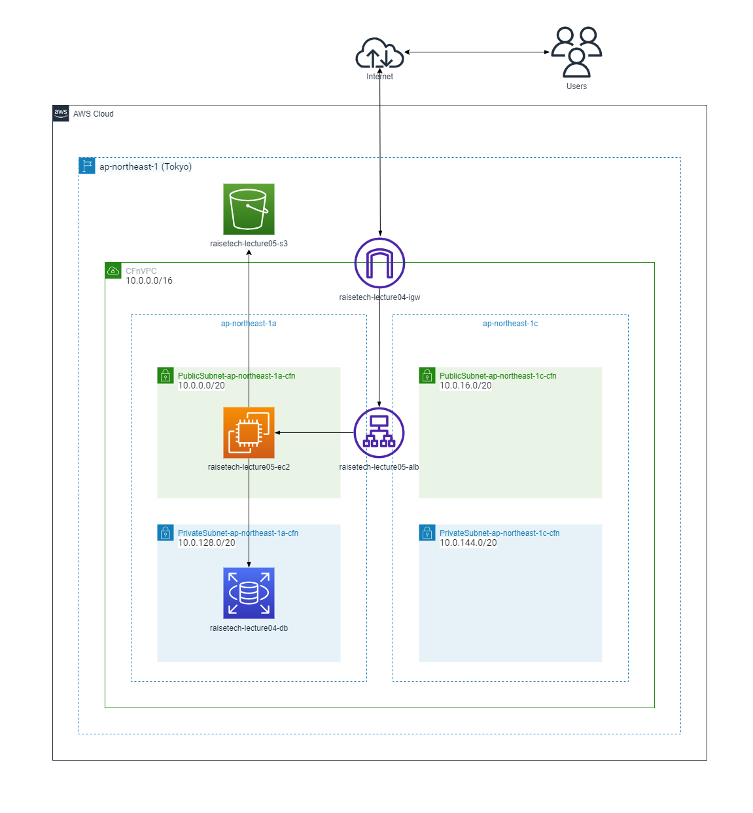
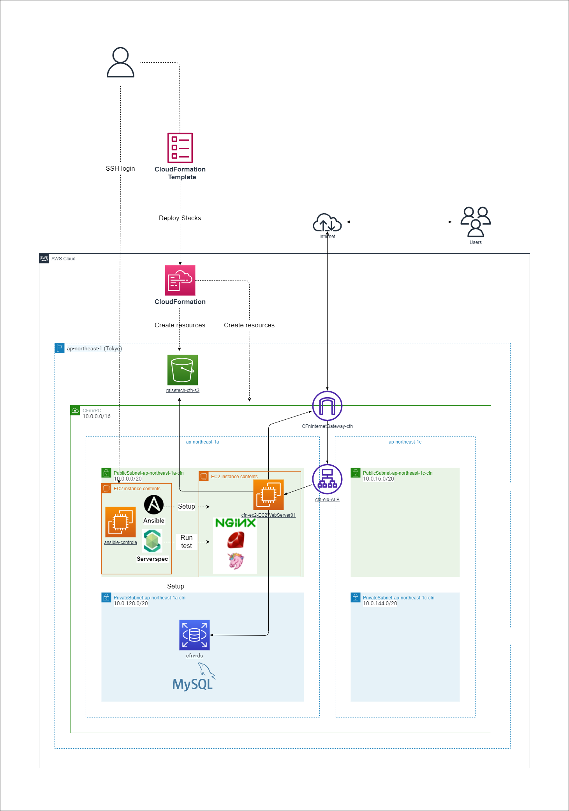

# 【 インフラ等構築・自動化/パイプライン構築　実践 】<br>

## ■ 概要　( 目次・各ページ内リンク )
- インフラ等の構築・自動化/パイプライン構築など、下記の実践内容を記載
  - [AWS上に Ruby on Rails のサンプルアプリケーションをデプロイ　( シングルAZ構成/手動構築 )](#-aws上に-ruby-on-rails-のサンプルアプリケーションをデプロイ)
  - [【 IaC 】 CloudFormation を使用したインフラリソースの構築　( 冗長化構成/シングルAZ構成 )](#--iac--cloudformation-を使用したインフラリソースの構築)
  - [【 IaC 】 Terraform を使用したインフラリソースの構築　( 冗長化構成 )](#--iac--terraform-を使用したインフラリソースの構築)
  - [【 CI/CD 】 CircleCI による 自動化・パイプライン構築　( 簡易処理を実行 )](#--cicd-circleci-による-自動化パイプライン構築)
- 学習記録 一覧　( 自己のアウトプットとして実践内容を記録したもの )
  - [Webエンジニアリングスクールでの実践/学習記録 一覧](#-webエンジニアリングスクールでの実践学習記録-一覧)
  - [継続実践/学習記録 一覧　( Terraform / CloudFormation / Ansible / Serverspec )](#-継続実践学習記録-一覧)

<br>

---
## ■ AWS上に Ruby on Rails のサンプルアプリケーションをデプロイ<br>
【 実践内容 】
- EC2上にサンプルアプリケーションをデプロイ
  - 組み込みサーバ ( Puma ) でデプロイ
  - Webサーバ ( Nginx ) / APサーバ ( Unicorn ) に分けてデプロイ
- ELB (ALB) / S3  を追加・動作確認
- Rails の Active Storage を連携、画像の保存先をS3に設定
- AWS構成図作成 ( VPC / EC2 / RDS / ELB / S3 )
- 自動テスト ( ServerSpec )

| 動作環境 | バージョン |
| -------- | ---------- |
| Ruby     | 3.1.2      |
| Bundler  | 2.3.14     |
| Rails    | 7.0.4      |
| Node     | v17.9.1    |
| Yarn     | 1.22.19    | <br>

<br>

- デプロイ - [全手順](./Tasks/lecture05/lecture05.md)
- デプロイ - [部分手順](./Tasks/lecture05//building_procedure) ( ※上記各手順別の構築・設定手順 )
- テスト - [ServerSpec](./Tasks/lecture11/lecture11.md)
- AWS構成図
<br>
- Webアプリケーション ( デプロイ・ブラウザ動作確認 )
/browser_check1.png)<br>

<br>

## ■ 【 IaC 】 CloudFormation を使用したインフラリソースの構築<br>
【 実践内容②：マルチAZ・冗長化構成 】
- [構築実践の取組](./cloudformation/practice01/cfn_practice01.md)　( ※下記 AWS構成図のリソース構築を実施 )
- 各リソース/スタックのテンプレートファイル ( [cfn_templates_redundant_configuration](./cloudformation/practice01/cfn_templates_redundant_configuration) ) を作成
- 実践内容① ( シングルAZ構成 ) の内容に下記を追加・設定変更
  - EC2 - シングルAZ から マルチAZ配置　( ※起動テンプレートを作成、AutoScalingに適用してEC2を起動 )
  - RDS - シングルAZ から マルチAZ配置　( ※MautiAZの有効化 )
- AWS構成図
  
- テンプレートファイル構成
  ```
  cfn_templates_redundant_configuration
  |-- 01_cfn-vpc.yml
  |-- 02_cfn-securitygroup.yml
  |-- 03_cfn-rds_multiaz.yml
  |-- 04_cfn-elb_autoscaling.yml
  |-- 05_cfn-ec2_autoscaling.yml
  `-- 06_cfn-s3.yml
  ```

【 実践内容①：シングルAZ構成 】
- [構築実践の取組](./Tasks/lecture10/lecture10.md)　( ※下記 AWS構成図のリソース構築を実施 )
- 各リソース/スタックのテンプレートファイル ( [CloudFormation_templates](./Tasks/lecture10/CloudFormation_templates) ) を作成
- その他、ベストプラクティス・セキュリティ対策を考慮して下記取組を実施
  - BlackBeltを参照してベストプラクティスなどをインプット、実践はその内容を踏まえて実施
  - スタック (テンプレート) の分割・構成については上記で得た設計観点・考え方を反映
  - ハードコーディングを避けるための動的参照 - SSMパラメータストア を活用
  - RDS - SecretsManager での認証情報 (シークレット) 管理を反映
  - EC2 - SessionManager を活用　( ※SSH接続に関する設定は、後学のために削除せず記述を残置 )<br>
- [CI/CDツール ( CircleCI：cfn-lint )](./Tasks/lecture12/lecture12.md) による CloudFormation テンプレート の構文チェック
- AWS構成図

- テンプレートファイル構成
  ```
  |-- CloudFormation_templates
      |-- 01_cfn-vpc.yml
      |-- 02_cfn-securitygroup.yml
      |-- 03_cfn-rds.yml
      |-- 04_cfn-ec2.yml
      |-- 05_cfn-elb.yml
      `-- 06_cfn-s3.yml
  ```
- 各リソースのスタック<br>
( ※各リソースのスタック名は テンプレートファイル名から引用/命名し、構築を実施 )<br>
<br>

<br>

## ■ 【 IaC 】 Terraform を使用したインフラリソースの構築
【 実践内容：マルチAZ・冗長化構成 】
- [構築実践の取組](./terraform/practice02/tf_practice02.md)　( ※下記 AWS構成図のリソース構築を実施 )<br>
( ※上記[ CloudFormtain (マルチAZ・冗長化構成)](#--iac--cloudformation-を使用したインフラリソースの構築) と同様の内容の構築を Terraform にて実施 )
- 各リソースの tfファイル ( [terraform_files_redundant_configuration](./terraform/practice02/terraform_files_redundant_configuration/) ) を作成
- その他、Terraform によるインフラリソース構築にあたっては下記内容を反映
  - ハードコーディングを避けるための動的参照 - SSMパラメータストア を活用
  - RDS - SecretsManager での認証情報 (シークレット) 管理を反映
  - EC2 - SessionManager を活用　( ※SSH接続に関する設定は、後学のために削除せず記述を残置 )
- AWS構成図
  
- tfファイル構成
  ```
  terraform_files_redundant_configuration
  |-- 01_vpc.tf
  |-- 02_securitygroup.tf
  |-- 03_rds_multiaz.tf
  |-- 04_ec2_autoscaling.tf
  |-- 04_ec2_userdata.sh 　
  |-- 05_iam.tf
  |-- 06_elb_autoscaling.tf
  |-- 07_s3.tf
  |-- data.tf
  |-- main.tf
  ```
- 作成リソース一覧　( ※リソース構築後、下記コマンドを実行して作成されたリソース一覧を表示 )
  ```
  $ terraform state list

  data.aws_ami.EC2WebServer01
  data.aws_iam_policy_document.ec2_assume_role
  data.aws_ssm_parameter.KeyName-terraform
  data.aws_ssm_parameter.MasterUsername-terraform
  data.aws_ssm_parameter.myIP-terraform
  aws_autoscaling_group.AutoScalingGroup
  aws_db_instance.RDSDBInstance
  aws_db_subnet_group.RDSDBSubnetGroup
  aws_iam_instance_profile.EC2InstanceProfile
  aws_iam_role.EC2IAMRole
  aws_iam_role_policy_attachment.EC2IAMRole_ssm_managed
  aws_internet_gateway.TerraformInternetGateway
  aws_launch_template.EC2LaunchTemplate
  aws_lb.ALB
  aws_lb_listener.ALBListener_http
  aws_lb_target_group.ALBTargetGroup
  aws_route.PublicRoute
  aws_route_table.PrivateRouteTable
  aws_route_table.PublicRouteTable
  aws_route_table_association.PrivateSubnet1aRouteTableAssociation
  aws_route_table_association.PrivateSubnet1cRouteTableAssociation
  aws_route_table_association.PublicSubnet1aRouteTableAssociation
  aws_route_table_association.PublicSubnet1cRouteTableAssociation
  aws_s3_bucket.S3Bucket
  aws_s3_bucket_server_side_encryption_configuration.S3Bucket
  aws_security_group.ALBSecurityGroup
  aws_security_group.EC2SecurityGroup
  aws_security_group.RDSSecurityGroup
  aws_security_group_rule.alb_egress
  aws_security_group_rule.alb_in_http
  aws_security_group_rule.ec2_web_in_http_from_ALB
  aws_security_group_rule.ec2_web_in_ssh
  aws_security_group_rule.ec2_web_in_tcp3000
  aws_security_group_rule.rds_egress
  aws_security_group_rule.rds_in_tcp3306_from_ec2
  aws_security_group_rule.web_egress
  aws_subnet.PrivateSubnet1a
  aws_subnet.PrivateSubnet1c
  aws_subnet.PublicSubnet1a
  aws_subnet.PublicSubnet1c
  aws_vpc.TerraformVPC
  random_string.s3_unique_key
  ```

<br>

## ■ 【 CI/CD】 CircleCI による 自動化・パイプライン構築
【 使用ツール 】
- CircleCI - パイプライン構築
- cfn-lint - CloudFormation テンプレート の構文チェック
- CloudFormation - インフラリソース構築 (シングルAZ構成)
- Ansible - 構成管理 / プロビジョニング
- ServerSpec - テスト

<br>

【 実践内容 】
- [自動化・パイプライン構築の取組](./Tasks/lecture13/lecture13.md)　
( ※下記 自動化処理フロー ＆ AWS構成図 の自動実行設定を実施 )
- 自動化処理・パイプラインを実行する CircleCI の設定ファイル [.circleci/config.yml](./.circleci/config.yml) を作成
- cfn-lint・CloudFormation については [上記取組 【実践内容①：シングルAZ構成】](#--iac--cloudformation-を使用したインフラリソースの構築) のものを一部修正して活用
- Ansible・ServereSpec については簡易的な実行処理を記述<br>
( ※ CloudFormation で構築した EC2 に Git をインストール＆テスト )
- 『 0→1 の実践 』 の考え、簡易パーツを組み合わせて動かすイメージで自動化の取組を実施<br>
( ※各ツールの深堀りについては継続学習中 )
- 自動化処理フロー ＆ AWS構成図

- [.circleci/config.yml](./.circleci/config.yml) の関連ファイル構成
  ```
  .
  |-- Tasks
  |   |-- lecture10
  |   |   |-- CloudFormation_templates
  |   |      |-- 01_cfn-vpc.yml
  |   |      |-- 03_cfn-rds.yml
  |   |      |-- 05_cfn-elb.yml
  |   |      `-- 06_cfn-s3.yml
  |   `-- lecture13
  |       |-- CloudFormation_templates
  |          |-- 02_cfn-securitygroup-ansible.yml
  |          `-- 04_cfn-ec2-ansible.yml
  |-- ansible
  |   |-- inventory
  |   `-- playbook.yml
  |-- ansible.cfg
  `-- serverspec
      |-- Gemfile
      |-- Gemfile.lock
      |-- Rakefile
      `-- spec
          |-- localhost
          |   `-- sample_spec.rb
          `-- spec_helper.rb
  ```
- CircleCI -  パイプライン構築　の実行結果

- cfn-lint -  CloudFormation テンプレート の構文チェック　の実行結果

- CloudFormation - インフラリソース構築　の実行結果
<br>
( CloudFormation - 作成スタック )

- Ansible - 構成管理 / プロビジョニング　の実行結果

- ServerSpec - テスト　の実行結果


<br>

## ■ Webエンジニアリングスクールでの実践/学習記録 一覧<br>
- スクール ( RaiseTech ) での実践/学習記録を各ファイルに記載
- 取組にあたっては、スクールからの操作手順書やドキュメントの提供はなし
- 自身で公式ドキュメント等を参照して情報収集・リサーチ(インプット)を実施
- 以下スクールの基本方針の元、実践・課題取組(アウトプット)を実施

<br>

【 スクールの基本方針 】
- ハンズオンベースによる学習
- 講義で「答え」が示されることははなく、課題設定があるものについては自主学習により取組む
- 指示のない部分については自分で考え、不明点がある場合は質問して解決していく

| №  | Tasks                                                                                                            | Files                                                   | Note             |
| :-: | :--------------------------------------------------------------------------------------------------------------: | :-----------------------------------------------------: | :--------------: |
| 01  | Git/GitHubを用いたチーム開発におけるバージョン管理                                                               | [lecture02.md](./Tasks/lecture02.md)                    | －               |
| 02  | Ruby on RailsによるWebアプリケーションのデプロイ                                                                 | [lecture03.md](./Tasks/lecture03.md)                    | －               |
| 03  | VPC･EC2･RDSの構築                                                                                              | [lecture04.md](./Tasks/lecture04.md)                    | 手動構築         |
| 04  | Ruby on Rails サンプルアプリケーションのデプロイ<br>・ELB(ALB) / S3 の構築・構成図作成                           | [lecture05.md](./Tasks/lecture05/lecture05.md)          | 手動構築         |
| 05  | 証跡・ロギング / 監視・通知 / コスト管理                                                                         | [lecture06.md](./Tasks/lecture06/lecture06.md)          | －               |
| 06  | セキュリティ対策                                                                                                 | [lecture07.md](./Tasks/lecture07/lecture07.md)          | －               |
| 07  | インフラ自動化 / IaC / CloudFormation                                                                            | [lecture10.md](./Tasks/lecture10/lecture10.md)          | 自動構築         |
| 08  | 自動テスト / ServerSpec                                                                                          | [lecture11.md](./Tasks/lecture11/lecture11.md)          | 自動化           |
| 09  | CI/CDツール ( CircleCI )                                                                                         | [lecture12.md](./Tasks/lecture12/lecture12.md)          | 自動化           |
| 10  | 構成管理 (プロビジョニング) ツール ( Ansible )　/<br> CircleCIへの組込 ( CloudFormation / Ansible / ServerSpec ) | [lecture13.md](./Tasks/lecture13/lecture13.md)          | 自動構築・自動化 |
| 11  | 自動化処理フロー ＆ AWS構成図 の作成など                                                                         | [lecture14-15.md](./Tasks/lecture14-15/lecture14-15.md) | 自動構築・自動化 | <br>

<br>

## ■ 継続実践/学習記録 一覧
- WebエンジニアリングスクールのAWSフルコース修了後、自主的な学習を継続
- これまでに学んだ内容の深掘り、また発展的な内容となるよう学習を実施
- 実践内容については自分で考え、アウトプットとして学習記録を各ファイルに記載<br>
( ※内容は下表を参照 )

| №  | Practices                              | Files                                                                        | Note                                                                                                                         |
| :-: | :------------------------------------: | :--------------------------------------------------------------------------: | :--------------------------------------------------------------------------------------------------------------------------: |
| 01  | Terraform<br> ( シングルAZ構成 )       | [tf_practice01.md](./terraform/practice01/tf_practice01.md)                  | [lecture10.md](./Tasks/lecture10/lecture10.md) の構成を Terraform で構築                                                     |
| 02  | CloudFormation<br> ( 冗長化構成 )      | [cfn_practice01.md](./cloudformation/practice01/cfn_practice01.md)           | [lecture10.md](./Tasks/lecture10/lecture10.md) の構成を<br> マルチAZ・冗長化構成 に変更                                      |
| 03  | Terraform<br> ( 冗長化構成 )           | [tf_practice02.md](./terraform/practice02/tf_practice02.md)                  | [tf_practice01.md](./terraform/practice01/tf_practice01.md) の構成を<br> マルチAZ・冗長化構成 に変更                         |
| 04  | Ansible ( basic )                      | [ansible_practice01.md](./ansible_practice/practice01/ansible_practice01.md) | 動作環境構築・設定 /<br> ロール分割 / 複数ホスト処理                                                                         |
| 05  |Ansible ( advanced )<br> ＋ Serverspec | [ansible_practice02.md](./ansible_practice/practice02/ansible-practice02.md) | [lecture05.md](./Tasks/lecture05/lecture05.md)：サンプルアプリケーションの<br> デプロイ・手動構築＋テスト を自動化 | <br>

### ■ 【 № 05 . Ansible ( advanced ) ＋ Serverspec：構成図・自動化処理フロー図 】


【 実践内容：[ansible_practice02.md](./ansible_practice/practice02/ansible-practice02.md) 】
- [lecture05.md](./Tasks/lecture05/lecture05.md) の サンプルアプリケーションのデプロイ・手動構築 + テスト実行 を、 Ansible・Serverspec にて自動化
- インフラリソースについては、[lecture10 の CloudFormation_templates (シングルAZ構成)](./Tasks/lecture10/CloudFormation_templates/) を使用して構築
- 上記環境上に 新規EC2 (コントロールノード) をマネージメントコンソールで作成し、Playbook等のファイル群を作成
- コントロールノードからターゲットノードへ  OS/ミドルウェアレイヤーのインストール・設定・起動等を自動実行
- デプロイが成功しているか動作確認　( ※ブラウザ等で確認 )
- その後、Serverspec が動作するよう手動にてコントロールノードに環境構築を実施
- テストの自動実行を実施　( ※コントロールノードからターゲットノードへのテストを実行 )
- テスト結果の確認

<br>

- ディレクトリ・ファイル構成　【 Ansible関連：[/ansible-practice02](./ansible_practice/practice02/ansible-practice02) 】
  ```
  /ansible-practice02
    │
    ├── ansible.cfg
    ├── env_set.sh
    ├── inventory
    ├── playbook.yml
    ├── roles
    │   ├── 00_common
    │   │   └── tasks
    │   │       └── main.yml
    │   ├── 01_ruby
    │   │   └── tasks
    │   │       └── main.yml
    │   ├── 02_bundler_rails
    │   │   └── tasks
    │   │       └── main.yml
    │   ├── 03_node_yarn
    │   │   └── tasks
    │   │       └── main.yml
    │   ├── 04_mysql
    │   │   └── tasks
    │   │       └── main.yml
    │   ├── 05_app_puma
    │   │   ├── tasks
    │   │   │   └── main.yml
    │   │   └── templates
    │   │       └── database.yml.j2
    │   ├── 06_s3
    │   │   ├── tasks
    │   │   │   └── main.yml
    │   │   └── templates
    │   │       └── storage.yml.j2
    │   └── 07_app_nginx_unicorn
    │       ├── tasks
    │       │   └── main.yml
    │       └── templates
    │           └── raisetech-live8-sample-app.conf.j2
    └── vars.yml
  ```
- ディレクトリ・ファイル構成　【 Serverspec関連：[/serverspec](./ansible_practice/practice02/serverspec) 】
  ```
  /serverspec
    │
    ├── Gemfile
    ├── Gemfile.lock
    ├── Rakefile
    ├── .rspec
    └── spec
        ├── cfn-ec2-EC2WebServer01
        │   └── sample_spec.rb
        └── spec_helper.rb
  ```
