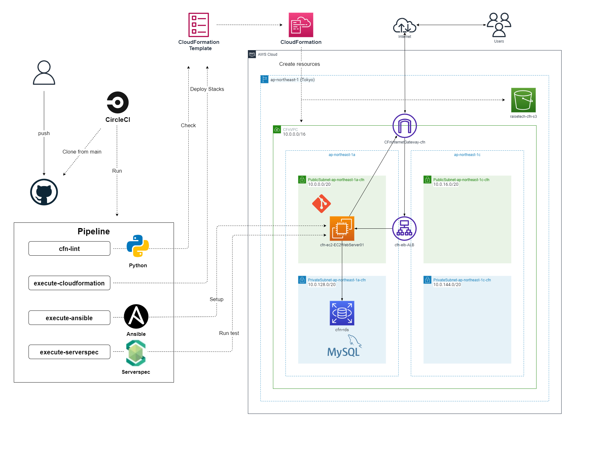

# RaiseTech - AWSフルコース ：課題取組
- これまでの課題取組一覧

| Files                                                  | Contents                                                                                |
| :---------------------------------------------------: | :------------------------------------------------------------------------------------: |
| [lecture02.md](./Tasks/lecture02.md)           | Git/GitHubを用いたチーム開発におけるバージョン管理                                     |
| [lecture03.md](./Tasks/lecture03.md)           | Ruby on RailsによるWebアプリケーションのデプロイ                                       |
| [lecture04.md](./Tasks/lecture04.md)           | VPC･EC2･RDSの構築                                                                    |
| [lecture05.md](./Tasks/lecture05/lecture05.md) | Ruby on Rails サンプルアプリケーションのデプロイ ・ELB(ALB) / S3 の構築・構成図作成 |
| [lecture06.md](./Tasks/lecture06/lecture06.md) | 証跡・ロギング / 監視・通知 / コスト管理                                               |
| [lecture07.md](./Tasks/lecture07/lecture07.md) | セキュリティ対策                                                                       |
| [lecture10.md](./Tasks/lecture10/lecture10.md) | インフラ自動化 / IaC / CloudFormation                                                  |
| [lecture11.md](./Tasks/lecture11/lecture11.md) | インフラの自動テスト / ServerSpec                                                  |
| [lecture12.md](./Tasks/lecture12/lecture12.md) | CI/CDツール ( CircleCI )                                                   |
| [lecture13.md](./Tasks/lecture13/lecture13.md) | 構成管理(プロビジョニング)ツール ( Ansible ) / CircleCIへの組込                                                   |
| [lecture14-15.md](./Tasks/lecture14-15/lecture14-15.md) | 全自動化処理フロー・AWS構成図 の作成など                                                   | 

- 最終課題(インフラ自動化)の構成図

- CircleCI - Pipeline 実行結果

