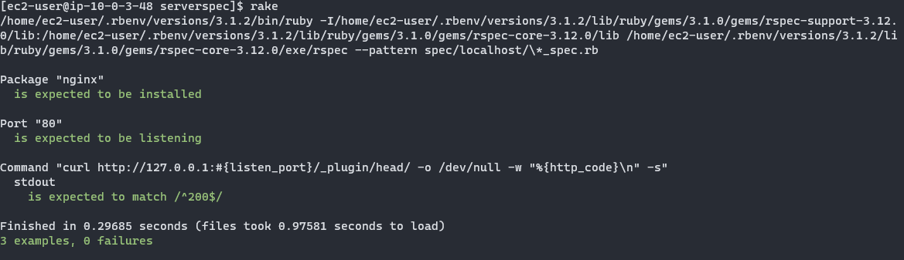
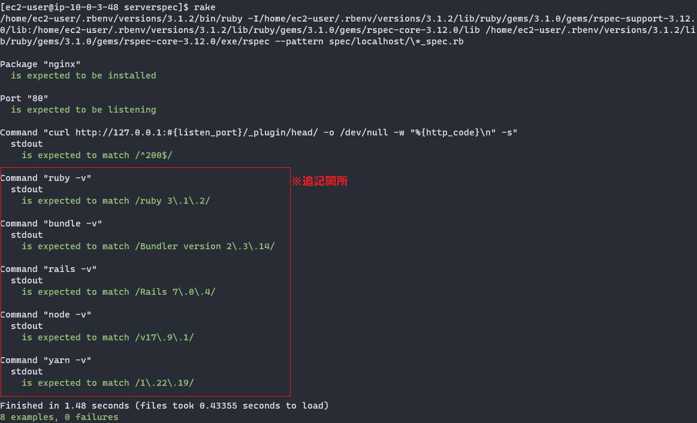

# 【 lecture11：インフラの自動テスト / ServerSpec 】

## ■ ServerSpecを使用して自動テストを実行
- 事前作業 - EC2・RDS を起動
  - EC2 - [Lecture05](../lecture05/lecture05.md) で構築したEC2のAMIを使用
  - RDS - 同上のスナップショットより復元
- SessionManager を使用してログイン、後工程のため下記を実行
```
#bash切替
$ bash　

#ユーザ切替
$ sudo su - ec2-user　

#サンプルアプリケーションのディレクトリへ移動
$ cd raisetech-live8-sample-app/
```
- [Nginx・Unicorn](../lecture05/building_procedure/Web-Nginx_AP-Unicorn.md) を起動　(※必要に応じてブラウザにて動作確認も実施)
- ServerSpec をインストール
```
#Gemfileに gem 'serverspec' を追記
$ vim Gemfile

#Bundlerを使用してGemfile記載のライブラリ群をインストール
$ bundle install

#インストール確認
$ gem list | grep serverspec
```
- テスト実行用のディレクトリ作成・移動 (※ディレクトリ名は任意)
```
$ mkdir severspec
$ cd severspec
```
- SeverSpecの環境設定・サンプルコード作成
```
$ bundle exec serverspec-init
```
- 【 1) UN*X 】 　【 2) Exec (local) 】　 を選択
```
Select OS type:

  1) UN*X
  2) Windows

Select number: 1

Select a backend type:

  1) SSH
  2) Exec (local)

Select number: 2

 + spec/localhost/
 + spec/localhost/sample_spec.rb
/home/ec2-user/.rbenv/versions/3.1.2/lib/ruby/gems/3.1.0/gems/serverspec-2.42.2/lib/serverspec/setup.rb:155: warning: Passing safe_level with the 2nd argument of ERB.new is deprecated. Do not use it, and specify other arguments as keyword arguments.
/home/ec2-user/.rbenv/versions/3.1.2/lib/ruby/gems/3.1.0/gems/serverspec-2.42.2/lib/serverspec/setup.rb:155: warning: Passing trim_mode with the 3rd argument of ERB.new is deprecated. Use keyword argument like ERB.new(str, trim_mode: ...) instead.
!! spec/spec_helper.rb already exists and differs from template
!! Rakefile already exists and differs from template
 + .rspec
```
- `Rakefile` ・ `specディレクトリ` など、新規ファイル・ディレクトリが作成されていることを確認
```
$ ls　　#下記は実行結果
-------------------------------------
[ec2-user@ip-10-0-0-202 severspec]$ ls
Rakefile  spec
-------------------------------------
```

- 作成された `sample_spec.rb` を下記内容に編集<br>
```
$ vim spec/localhost/sample_spec.rb

-------------------------------------
require 'spec_helper'

#テストするポートの定義
listen_port = 80

#Nginxがインストール済か
describe package('nginx') do
  it { should be_installed }
end

#指定のポートがリッスン（通信待ち受け状態）か
describe port(listen_port) do
  it { should be_listening }
end

#テスト接続して動作しているか
describe command('curl http://127.0.0.1:#{listen_port}/_plugin/head/ -o /dev/null -w "%{http_code}\n" -s') do
  its(:stdout) { should match /^200$/ }
end
-------------------------------------
```
- テストを実行　(※作成したディレクトリで実行)
```
$ rake
```
- 実行結果を確認　(※下記はテスト成功)<br>
<br>

## ■ テスト項目を追加し実行確認
- テストスクリプトの編集　(※上記 `sample_spec.rb` に下記を追記)
```
$ vim spec/localhost/sample_spec.rb

-------------------------------------
#Rubyが指定のバージョンか
describe command('ruby -v') do
  its(:stdout) { should match /ruby 3\.1\.2/ }
end

#Bundlerが指定のバージョンか
describe command('bundle -v') do
  its(:stdout) { should match /Bundler version 2\.3\.14/ }
end

#Railsが指定のバージョンか
describe command('rails -v') do
  its(:stdout) { should match /Rails 7\.0\.4/ }
end

#Nodeが指定のバージョンか
describe command('node -v') do
  its(:stdout) { should match /v17\.9\.1/ }
end

#Yarnが指定のバージョンか
describe command('yarn -v') do
  its(:stdout) { should match /1\.22\.19/ }
end
-------------------------------------
```
- テストを実行　(※作成したディレクトリで実行)
```
$ rake
```
- 実行結果を確認　(※下記はテスト成功)<br>
<br>


- (参考) アプリケーションの動作環境<br>

  | 動作環境 | バージョン |
  | -------- | ---------- |
  | Ruby     | 3.1.2      |
  | Bundler  | 2.3.14     |
  | Rails    | 7.0.4      |
  | Node     | v17.9.1    |
  | Yarn     | 1.22.19    |<br>

## ■ 感想・工夫点
- 今回は 0→1 の経験を積むため、簡易ではありますが SeverSpec によるインフラ自動テストの動作環境設定・サンプルコードの実行を実施しました。
- また、アプリケーションが仕様通りであるかということを想定してテストスクリプトに追記を行い、動作環境テストのカスタマイズを追加実施。
- SeverSpec を使いこなし、様々な構成管理チェックを行うには Ruby・RSpec・Rake (Rakefile) などについてより深く理解していく必要があるため今後の課題として勉強していきたいと思います。

## ■ 参考リンク
- [SeverSpec公式 - 使い方・チュートリアル](https://serverspec.org/)
- [「Serverspec」を使ってサーバー環境を自動テストしよう](https://knowledge.sakura.ad.jp/2596)
- [AWS備忘録７～serverspec~](https://note.com/kinako1525/n/n631440d86ac4)
- [【Serverspec】 Serverspec の Rakefile を調べた](https://go-journey.club/archives/7695)
- [Serverspec [ 書籍 - オライリー・ジャパン ] ](https://www.oreilly.co.jp/books/9784873117096/)(※今後勉強する際に参考としたい)
