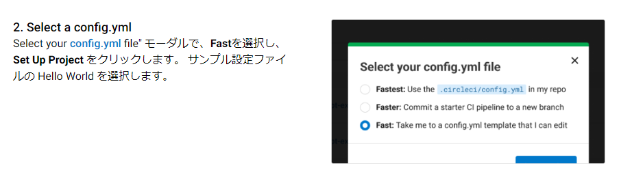
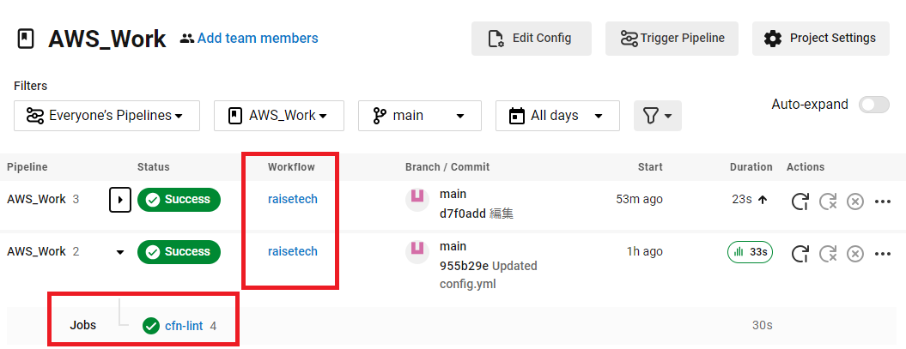
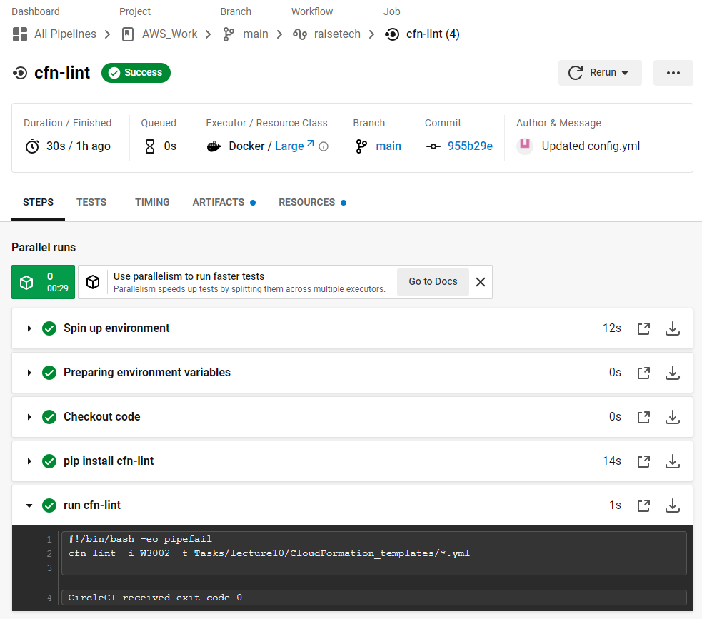

# 【 lecture12：CI/CDツール ( CircleCI ) 】

## ■ CircleCIの動作確認　( GitHubリポジトリへの組込：CFnの構文チェック )
【 手順 】
- [公式ドキュメント](https://circleci.com/docs/ja/getting-started/)を参照して初期設定を試行
- 試行するも、初期設定フロー通りに設定できなかったため動作に必要な設定・挙動を確認して以降の対応を実施<br>
( ※遭遇した状況：下図の箇所でモーダル (ポップアップ画面) が出現せず )

- GitHubリモートリポジトリ上で下記内容の [config.yml](../../.circleci/config.yml) を作成　(※格納先は  [/.circleci ](../../.circleci))<br>
(※記述内容：[cfn-lint](https://github.com/aws-cloudformation/cfn-lint) を使用し、 [lecture10](../lecture10/lecture10.md) で作成した [CloudFormatin テンプレート](../lecture10/CloudFormation_templates/) の構文をチェック )
  ```
  version: 2.1
  orbs:
    python: circleci/python@2.0.3
  jobs:
    cfn-lint:
      executor: python/default
      steps:
        - checkout
        - run: pip install cfn-lint
        - run:
            name: run cfn-lint
            command: |
              cfn-lint -i W3002 -t Tasks/lecture10/CloudFormation_templates/*.yml

  workflows:
    raisetech:
      jobs:
        - cfn-lint
  ```

- CircleCI のWebUIにて、GitHubアカウント・リモートリポジトリを連携<br>
( ※ `Projects` より、連携させたいリモートリポジトリ欄にある `Set Up Project` を押下 )
- 上記 `/.circleci/config.yml` で定義・設定した `workflows・jobs` が実行される


## ■ CircleCIの実行結果
- 上図の `Jobs：cfn-lint` を押下して実行結果を表示・確認　(※結果は成功)


## ■ 感想
- 前回の [ServerSpec](../lecture11/lecture11.md) と同じく 0→1 を経験するため CircleCI の基本を学び、動作確認という形で CI/CD の実践を行いました。
- CFn構文チェックの動作結果としてはエラーは起きず。<br>
( [Lecture10 - CloudFormation](../lecture10/lecture10.md)  の実践時、 BlackBelt の内容を反映させるよう工夫。インプットには時間がかかりましたが、しっかり学んでいて良かったです。 )
- 今回の CircleCI は簡易に実行しましたが、今後はより深く定義・設定できるよう継続して CI/CD についても学んでいきたいと思います。

## ■ 参考リンク ( 実践取組 関連 )
- [CircleCI - スタートガイド](https://circleci.com/docs/ja/getting-started/)
- [AWS CloudFormation Linter](https://github.com/aws-cloudformation/cfn-lint)
- [cfn-lint を使った AWS CloudFormation テンプレートの Git pre-commit バリデーション](https://aws.amazon.com/jp/blogs/news/git-pre-commit-validation-of-aws-cloudformation-templates-with-cfn-lint/)
-  [CircleCI - 【チュートリアル】01 CircleCIをはじめよう！](https://www.youtube.com/watch?v=cOHKRYgdzDY)
-  [CircleCI - 【チュートリアル】02 CircleCIでビルドを成功させよう！](https://www.youtube.com/watch?v=hTM2nk8mSoQ)
- [【AWS Black Belt Online Seminar】　AWS CloudFormation](https://www.youtube.com/watch?v=Viyqh9fNBjw)
- [AWS CloudFormation のベストプラクティス](https://docs.aws.amazon.com/ja_jp/AWSCloudFormation/latest/UserGuide/best-practices.html)<br>


 ## ■ 参考リンク ( CircleCI CLI 関連 )
- [CircleCI のローカル CLI のインストール](https://circleci.com/docs/ja/local-cli/)
- [CircleCI CLIを活用してローカルでテストを行う方法](https://devops-blog.virtualtech.jp/entry/20220407/1649299372)
- [CircleCI CLIを触ってみた](https://zenn.dev/yuta28/articles/018f61d974a4d0)
- [ローカルでCircleCI CLIをつかってみる](https://qiita.com/chimpan/items/c5418cb82b9ce1e91617)
