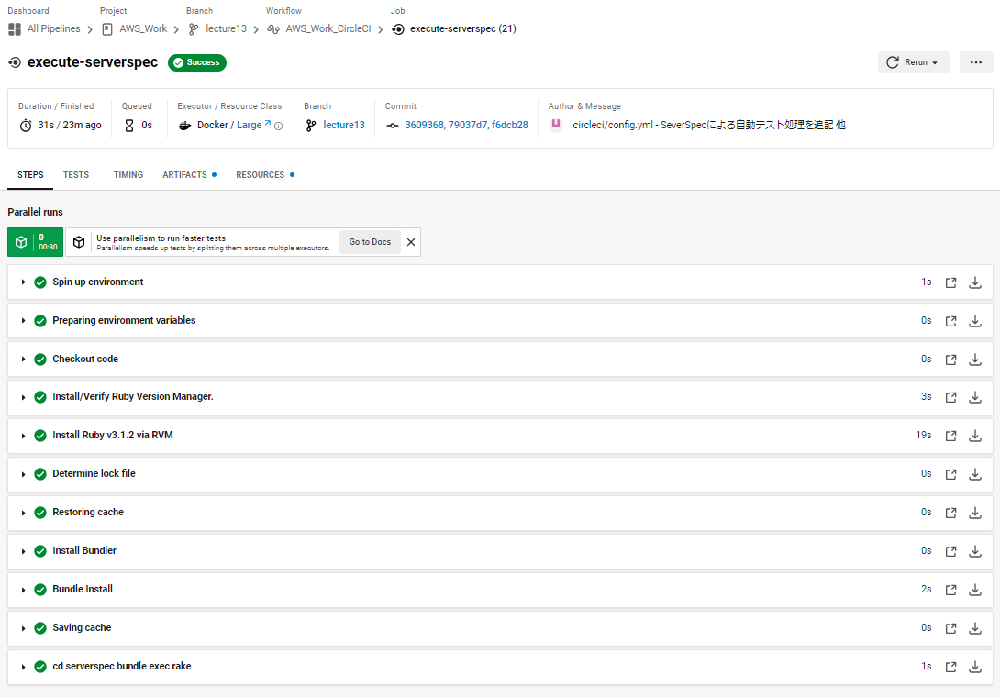
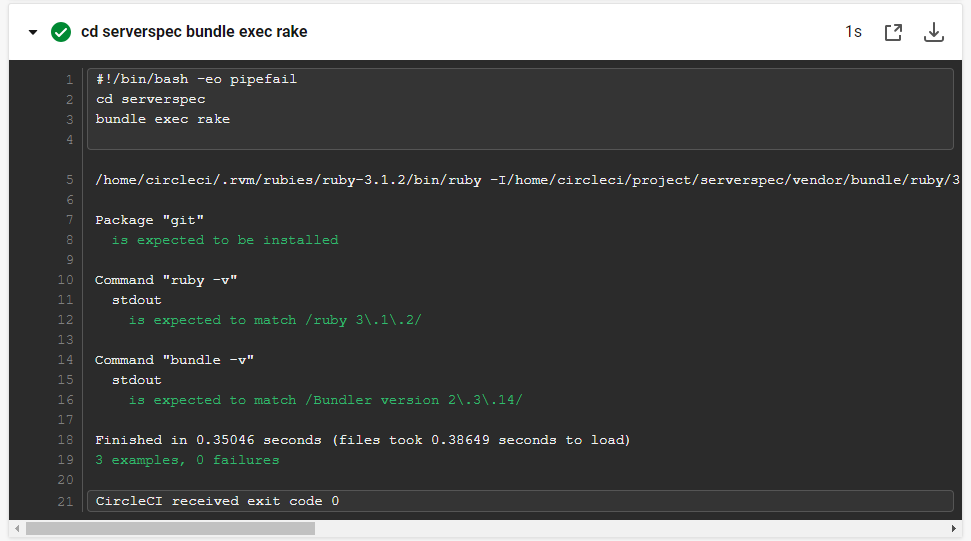

# 【 lecture13：構成管理(プロビジョニング)ツール ( Ansible ) / CircleCIへの組込 】

## ■ Ansible の環境構築・設定・処理実行
- コントロールノード用のEC2を起動　( AMI：Amazon Linux 2 )
- SessionManager を使用してログイン、Ansibleインストールのため下記を実行
  ```
  #bash切替
  $ bash　

  #ユーザ切替
  $ sudo su - ec2-user　

  #yumアップデート
  $ sudo yum -y update

  #Ansibleが使用できるか確認
  $ amazon-linux-extras | grep ansible

  #Ansibleを有効化
  $ sudo amazon-linux-extras enable ansible2

  #Ansibleをインストール
  $ sudo yum install -y ansible

  #インストール確認
  $ ansible --version

  #Pythonインストール確認 (※必要に応じてアップグレード実施)
  $ python -V
  ```
- ターゲットノード用のEC2を起動　( AMI：Amazon Linux 2 )
- ログイン後、下記を実行
  ```
  #yumアップデート
  $ sudo yum -y update
  ```
- コントロールノードにてターゲットノードへのSSH接続設定を実施
  - SecurityGroupを適切に設定
  - ローカルの秘密鍵をコントロールノードの `~/.ssh` 配下に送付
  - 秘密鍵の権限変更　`$ chmod 400 秘密鍵のパス`
  - 接続確認　`$ ssh -i 秘密鍵のパス ec2-user@ターゲットノードのIPアドレス`
  - 【補足】 ※別途 `~/.ssh/config` ファイルを使用する方法もあり
- コントロールノードにて `playbook.yml` ・ `inventory` を作成
  ```
  $ mkdir ansible
  $ cd ansible
  $ touch playbook.yml inventory
  ```
- `inventory` に接続するターゲットノードの情報を記述<br>
(※事前にコントロールノードからターゲットノードにSSH接続する設定が必要)
  ```
  [target_node]
  ターゲットノードのipアドレス

  [target_node:vars]
  ansible_ssh_user=ec2-user
  ansible_ssh_private_key_file="使用する秘密鍵のパス"
  ```
- 接続確認　( コントロールノード → ターゲットノード (※ansibleディレクトリ内でコマンドを実行) )
  ```
  $ ansible -i inventory target_node -m ping
  ```
-  `playbook.yml` に実行させたい処理を記述　(※今回はターゲットノードに Git をインストール)
    ```
    - hosts: target_node
      tasks:
      - name: install git
        become: yes
        yum:
          name: git
          state: latest
          lock_timeout: 180
    ```
- 処理を実行
  ```
  $ ansible-playbook -i inventory playbook.yml

  -------------------------------------
  #ドライラン
  $ ansible-playbook -i inventory playbook.yml --check

  #デバッグ
  $ ansible-playbook -i inventory playbook.yml -vvv

  #ドライラン + デバッグ
  $ ansible-playbook -i inventory playbook.yml --check -vvv
  ```
- ターゲットノードにて Git がインストールされているか確認
  ```
  $ git --version
  ```
## ■ CircleCIへの組込　( CloudFormation / Ansible / ServerSpec )
### ■ CloudFormation によるインフラリソース構築
- AnsibleでのSSH接続対応のため、 [lecture10](../../Tasks/lecture10/lecture10.md) の [CloudFormation_templates - 04_cfn-ec2.yml](../../Tasks/lecture10/CloudFormation_templates/04_cfn-ec2.yml) に下記を追記<br>
( ※併せて [02_cfn-securitygroup.yml](../../Tasks/lecture10/CloudFormation_templates/02_cfn-securitygroup.yml) のSSH接続設定も変更 )
  ```
  #EC2 に 既存の EIP をアタッチ
    EIPAssociation:
      Type: AWS::EC2::EIPAssociation
      Properties:
        InstanceId: !Ref EC2WebServer01
        EIP: 54.150.101.186
  ```
  <details><summary>【 補足：EC2 に 新規取得したEIP をアタッチする記述 】</summary>

  ```
    NewMyEIP:
      Type: AWS::EC2::EIP
      Properties:
        InstanceId: !Ref EC2WebServer01
  ```

  </details>

- 上記更新したテンプレートを [Tasks/lecture13/CloudFormation_templates/](./CloudFormation_templates/) 配下に [04_cfn-ec2-ansible.yml](./CloudFormation_templates/04_cfn-ec2-ansible.yml) ・ [02_cfn-securitygroup-ansible.yml](./CloudFormation_templates/02_cfn-securitygroup-ansible.yml) として新規作成
-  `aws cli` を使用し、手動にて挙動等を確認　( ※CFn実行には `aws cloudformation deploy` コマンドを使用 )
- `.circleci/config` に `cfn-lint` による Cloudformationテンプレート の構文をチェックする処理を追記　( 参照： [lecture12](../../Tasks/lecture12/lecture12.md)  )
  ```
  version: 2.1
  orbs:
    python: circleci/python@2.0.3

  jobs:
    cfn-lint:
      executor: python/default
      steps:
        - checkout
        - run: pip install cfn-lint
        - run:
            name: run cfn-lint
            command: |
              cfn-lint -i W3002 -t Tasks/lecture10/CloudFormation_templates/*.yml
              cfn-lint -i W3002 -t Tasks/lecture13/CloudFormation_templates/*.yml

  workflows:
    AWS_Work_CircleCI:
      jobs:
        - cfn-lint
  ```
- `aws cli` を使用するため、CircleCI上より 下記の環境変数 ( `Environment Variables` ) を設定
  - AWS_ACCESS_KEY_ID
  - AWS_SECRET_ACCESS_KEY
  - AWS_DEFAULT_REGION
- `.circleci/config` に `aws cli` による Cloudformation を実行する処理を追記　( ※ `aws cli` の `ORBS` を使用 )
  ```
  version: 2.1
  orbs:
    aws-cli: circleci/aws-cli@4.0.0

  jobs:
    execute-cloudformation:
      executor: aws-cli/default
      steps:
        - checkout
        - aws-cli/setup:
            aws_access_key_id: AWS_ACCESS_KEY_ID
            aws_secret_access_key: AWS_SECRET_ACCESS_KEY
            region: ${AWS_DEFAULT_REGION}
        - run:
            name: deploy Cloudformation
            command: |   #パイプは改行させてコマンドを実行させてたい場合に必要
              set -x     #シェルが実行コマンドとその引数を出力
              aws cloudformation deploy --stack-name cfn-vpc --template-file  Tasks/lecture10/CloudFormation_templates/01_cfn-vpc.yml
              aws cloudformation deploy --stack-name cfn-securitygroup --template-file  Tasks/lecture13/CloudFormation_templates/02_cfn-securitygroup-ansible.yml
              aws cloudformation deploy --stack-name cfn-rds --template-file  Tasks/lecture10/CloudFormation_templates/03_cfn-rds.yml
              aws cloudformation deploy --stack-name cfn-ec2 --template-file  Tasks/lecture13/CloudFormation_templates/04_cfn-ec2-ansible.yml --capabilities CAPABILITY_NAMED_IAM
              aws cloudformation deploy --stack-name cfn-elb --template-file  Tasks/lecture10/CloudFormation_templates/05_cfn-elb.yml
              #aws cloudformation deploy --stack-name cfn-s3 --template-file  Tasks/lecture10/CloudFormation_templates/06_cfn-s3.yml

  workflows:
    AWS_Work_CircleCI:
      jobs:
        - execute-cloudformation
  ```
- CircleCI・AWSマネジメントコンソール上で、CloudFormationの実行結果を確認


### ■ Ansible による構成管理(プロビジョニング)の実行
- `AWS_Work` ルートディレクトリに `ansible` ディレクトリを作成、その配下に `playbook.yml` ・ `inventory` を作成
- `playbook.yml` に、 ` ターゲットノードへ Git をインストール` する処理(下記)を記述　
    ```
    #【Gitインストール】：ansible - playbook.yml の記述

    - hosts: target_node
      tasks:
      - name: install git
        become: yes
        yum:
          name: git
          state: latest
          lock_timeout: 180
    ```
- `inventory` に下記を記述
  ```
  [target_node]
  54.150.101.186  #既存のEIP ( ※ターゲットノードのipアドレス )
  ```
- `AWS_Work` ルートディレクトリに `ansible.cfg` を作成、SSH接続に必要な下記を記述
  ```
  [ssh_connection]
  ssh_args =  -o ControlMaster=auto -o ControlPersist=60s -o StrictHostKeyChecking=no
  ```
- CircleCI上の `SSH Keys` - `Additional SSH Keys` より `Hostname (EIP)` ・ `Private Key` を登録
- `Fingerprint` の値を下記の `.circleci/config` に記述
- `.circleci/config` に `Ansible` による構成管理(プロビジョニング)の実行を追記　( ※ `ansible` の `ORBS` を使用 )
  ```
  version: 2.1
  orbs:
    ansible-playbook: orbss/ansible-playbook@0.0.5

  jobs:
    execute-ansible:
      executor: ansible-playbook/default
      steps:
        - checkout
        - add_ssh_keys:
            fingerprints:
              - "28:be:a7:0c:50:3a:17:2f:e8:8f:5c:ab:a9:1d:ac:f9"
        - ansible-playbook/install:
            version: 2.10.7
        - ansible-playbook/playbook:
            playbook: ansible/playbook.yml
            playbook-options: "-u ec2-user -i ansible/inventory --private-key ~/.ssh/id_rsa"

  workflows:
    AWS_Work_CircleCI:
      jobs:
        - execute-ansible
  ```
- CircleCI上で、Ansibleの実行結果を確認

### ■ ServerSpec によるテスト実行
- 自動テスト構築の確認のため、[lecture11](../lecture11/lecture11.md) では実施していなかった SeverSpec を動かすための環境構築 (最小限の構成) を手動で実施。
  - EC2 に `rbenv / ruby / bundler` をインストール　(  [EC2_eivironment_deploy.md](../lecture05/building_procedure/EC2_eivironment_deploy.md) を参考に実施)
  - `serverspec`ディレクトリを作成　( ※ディレクトリ名は任意 )
  - `serverspec`ディレクトリに移動し、 `Gemfile` を作成
  - `Gemfile` に `serverspec` `rake` を記載し、`bundle install` を実行
  - インストール実行後、 `Gemfile.lock` が作成されることを確認
  - インストール確認　`gem list | grep serverspec && gem list | grep rake`
  - SeverSpecの環境設定・サンプルコード作成　`bundle exec serverspec-init`
  - 【 1) UN*X 】 【 2) Exec (local) 】 を選択
  - `Rakefile` ・ `specディレクトリ` ・ `.rspec` など、新規ファイル・ディレクトリが作成されていることを確認　`ls`
  - 作成された sample_spec.rb を下記内容に編集
    ```
    $ vim spec/localhost/sample_spec.rb

    -------------------------------------
    require 'spec_helper'

    #Gitがインストールされているか
    describe package('git') do
      it { should be_installed }
    end

    #Rubyが指定のバージョンか
    describe command('ruby -v') do
      its(:stdout) { should match /ruby 3\.1\.2/ }
    end

    #Bundlerが指定のバージョンか
    describe command('bundle -v') do
      its(:stdout) { should match /Bundler version 2\.3\.14/ }
    end
    -------------------------------------
    ```
  - テスト実行　 `bundle exec rake`
  - テスト成功を確認
  
  - 【補足】 上記実行後のディレクトリ・ファイル構成
    ```
    [ec2-user@ip-10-0-7-80 ~]$ pwd
    /home/ec2-user
    [ec2-user@ip-10-0-7-80 ~]$ tree
    .
    └── severspec
        ├── Gemfile
        ├── Gemfile.lock
        ├── Rakefile
        └── spec
            ├── localhost
            │   └── sample_spec.rb
            └── spec_helper.rb

    3 directories, 5 files
    ```
- 上記を踏まえて CircleCI での自動テストの構築を実施
  - 上記作成した `serverspec` ディレクトリ配下のファイル群を、 `AWS_Work` のルートディレクトリに移動
  - `.circleci/config` に `SeverSpec` によるテストを実行する処理を追記　( ※ `Ruby` の `ORBS` を使用 )
    ```
    version: 2.1
    orbs:
      ruby: circleci/ruby@2.0.1

    jobs:
      execute-serverspec:
        executor: ruby/default
        steps:
          - checkout
          - ruby/install:  #Ruby をバージョン指定してインストール
              version: 3.1.2
          - ruby/install-deps:  #Bundler を使用して gem をインストール
              bundler-version: 2.3.14  #Bundler をバージョン指定してインストール
              app-dir: serverspec  #Gemfile を含むディレクトリへのパス ( ※Gemfile がルートに存在する場合は不要 )
          - run: |
              cd serverspec
              bundle exec rake

    workflows:
      AWS_Work_CircleCI:
        jobs:
          - execute-serverspec
    ```
- CircleCI上で、ServerSpecの実行結果を確認
## ■動作確認
- CircleCI 一連の実行 ( パイプライン ) 結果

- cfn-lint の実行結果

- CloudFormation の実行結果
<br>
( CloudFormation - スタック / リソース )<br>


- Ansible の実行結果

- ServerSpec の実行結果



## ■ CircleCI - .circleci/config.yml の関連ファイル構成
```
.
|-- Tasks
|   |-- lecture10
|   |   |-- CloudFormation_templates
|   |      |-- 01_cfn-vpc.yml
|   |      |-- 03_cfn-rds.yml
|   |      |-- 05_cfn-elb.yml
|   |      `-- 06_cfn-s3.yml
|   `-- lecture13
|       |-- CloudFormation_templates
|          |-- 02_cfn-securitygroup-ansible.yml
|          `-- 04_cfn-ec2-ansible.yml
|-- ansible
|   |-- inventory
|   `-- playbook.yml
|-- ansible.cfg
`-- serverspec
    |-- Gemfile
    |-- Gemfile.lock
    |-- Rakefile
    `-- spec
        |-- localhost
        |   `-- sample_spec.rb
        `-- spec_helper.rb
```
## ■ 感想
- 今回の取組方針としては、インフラ構築・構成管理(プロビジョニング)・テストの自動化を最小構成で実施。
-  Lecture11 以降については、『 0-1 をまずはやってみる 』 『とりあえず実践して試してみる』 の精神・考えで取組を行いました。
- そのため、取組内容としては簡単なパーツを組み合わせて動かしてみるというイメージで実践・実施。
- 実際にこれまで手動で行ってきた作業の自動化を実施してみて、改めて各種の挙動確認や動作の理解、トライ＆エラーがいかに重要かを実感することができました。
- 今後はこれまでの過程で得たことを活かしつつ、これまで実践した各内容の深掘りをやっていきたいと思います。
