# 【 lecture13：構成管理(プロビジョニング)ツール　( Ansible )　/<br> 　CircleCIへの組込　( CloudFormation / Ansible / ServerSpec ) 】

  - [Ansible の環境構築・設定・処理実行](#-ansible-の環境構築設定処理実行)
  - [CircleCI への組込　( CloudFormation / Ansible / ServerSpec )](#-circleci-への組込-cloudformation--ansible--serverspec-)
    - [CloudFormation によるインフラリソース構築](#-cloudformation-によるインフラリソース構築)
    - [Ansible による構成管理(プロビジョニング)の実行](#-ansible-による構成管理プロビジョニングの実行)
    - [ServerSpec によるテスト実行](#-serverspec-によるテスト実行)
      - [【 ① ServerSpec によるテストを Local環境/実行ホスト でのみ行う際の環境構築 】](#--serverspec-によるテストを-local環境実行ホスト-でのみ行う際の環境構築-)
      - [【 ② ServerSpec によるテストを 実行ホストからターゲットノード(ホスト)へ行う際の環境構築 】](#--serverspec-によるテストを-実行ホストからターゲットノードホストへ行う際の環境構築-)
      - [【 上記②を踏まえて CircleCI での自動テストの構築を実施 】](#-上記を踏まえて-circleci-での自動テストの構築を実施-)
  - [CircleCI - 実行結果/動作確認](#-circleci---実行結果動作確認)
  - [CircleCI - .circleci/config.yml の関連ファイル構成](#-circleci---circleciconfigyml-の関連ファイル構成)
  - [感想](#-感想)
  - [参考リンク](#-参考リンク)

## ■ Ansible の環境構築・設定・処理実行
- コントロールノード用のEC2を起動　( AMI：Amazon Linux 2 )
- SessionManager を使用してログイン、Ansibleインストールのため下記を実行
  ```
  #ユーザ切替
  $ sudo su - ec2-user　

  #yumアップデート
  $ sudo yum -y update

  #Ansibleが使用できるか確認
  $ amazon-linux-extras | grep ansible

  #Ansibleを有効化
  $ sudo amazon-linux-extras enable ansible2

  #Ansibleをインストール
  $ sudo yum install -y ansible

  #インストール確認
  $ ansible --version
  ```
- ターゲットノード用のEC2を起動　( AMI：Amazon Linux 2 )
- ログイン後、下記を実行
  ```
  #yumアップデート
  $ sudo yum -y update
  ```
- コントロールノードにてターゲットノードへのSSH接続設定を実施
  - SecurityGroupを適切に設定
  - ローカルの秘密鍵をコントロールノードの `~/.ssh` 配下に送付
  - 秘密鍵の権限変更　`$ chmod 400 秘密鍵のパス`
  - 接続確認　`$ ssh -i 秘密鍵のパス ec2-user@ターゲットノードのIPアドレス`
  - 【補足】 ※別途 `~/.ssh/config` ファイルを使用する方法もあり
- コントロールノードにて `playbook.yml` ・ `inventory` を作成
  ```
  $ mkdir ansible
  $ cd ansible
  $ touch playbook.yml inventory
  ```
- `inventory` に接続するターゲットノードの情報を記述<br>
(※事前にコントロールノードからターゲットノードにSSH接続する設定が必要)
  ```
  [target_node]
  ターゲットノードのipアドレス

  [target_node:vars]
  ansible_ssh_user=ec2-user
  ansible_ssh_private_key_file="使用する秘密鍵のパス"
  ```
- 接続確認　( コントロールノード → ターゲットノード (※ansibleディレクトリ内でコマンドを実行) )
  ```
  $ ansible -i inventory target_node -m ping
  ```
-  `playbook.yml` に実行させたい処理を記述　(※今回はターゲットノードに Git をインストール)
    ```
    - hosts: target_node
      tasks:
      - name: install git
        become: yes
        yum:
          name: git
          state: latest
          lock_timeout: 180
    ```
- 処理を実行
  ```
  $ ansible-playbook -i inventory playbook.yml

  -------------------------------------
  #ドライラン
  $ ansible-playbook -i inventory playbook.yml --check

  #デバッグ
  $ ansible-playbook -i inventory playbook.yml -vvv

  #ドライラン + デバッグ
  $ ansible-playbook -i inventory playbook.yml --check -vvv
  ```
- ターゲットノードにて Git がインストールされているか確認
  ```
  $ git --version
  ```
## ■ CircleCI への組込　( CloudFormation / Ansible / ServerSpec )
### ■ CloudFormation によるインフラリソース構築
- AnsibleでのSSH接続対応のため、 [lecture10](../../Tasks/lecture10/lecture10.md) の [CloudFormation_templates - 04_cfn-ec2.yml](../../Tasks/lecture10/CloudFormation_templates/04_cfn-ec2.yml) に下記を追記<br>
( ※併せて [02_cfn-securitygroup.yml](../../Tasks/lecture10/CloudFormation_templates/02_cfn-securitygroup.yml) のSSH接続設定も変更 )
  ```
  #EC2 に 既存の EIP をアタッチ
    EIPAssociation:
      Type: AWS::EC2::EIPAssociation
      Properties:
        InstanceId: !Ref EC2WebServer01
        EIP: 54.150.101.186
  ```
  <details><summary>【 補足：EC2 に 新規取得したEIP をアタッチする記述 】</summary>

  ```
    NewMyEIP:
      Type: AWS::EC2::EIP
      Properties:
        InstanceId: !Ref EC2WebServer01
  ```

  </details>

- 上記更新したテンプレートを [Tasks/lecture13/CloudFormation_templates/](./CloudFormation_templates/) 配下に [04_cfn-ec2-ansible.yml](./CloudFormation_templates/04_cfn-ec2-ansible.yml) ・ [02_cfn-securitygroup-ansible.yml](./CloudFormation_templates/02_cfn-securitygroup-ansible.yml) として新規作成
-  `aws cli` を使用し、手動にて挙動等を確認　( ※CFn実行には `aws cloudformation deploy` コマンドを使用 )
- `.circleci/config` に `cfn-lint` による Cloudformationテンプレート の構文をチェックする処理を追記　( 参照： [lecture12](../../Tasks/lecture12/lecture12.md)  )
  ```
  version: 2.1
  orbs:
    python: circleci/python@2.0.3

  jobs:
    cfn-lint:
      executor: python/default
      steps:
        - checkout
        - run: pip install cfn-lint
        - run:
            name: run cfn-lint
            command: |
              cfn-lint -i W3002 -t Tasks/lecture10/CloudFormation_templates/*.yml
              cfn-lint -i W3002 -t Tasks/lecture13/CloudFormation_templates/*.yml

  workflows:
    AWS_Work_CircleCI:
      jobs:
        - cfn-lint
  ```
- `aws cli` を使用するため、CircleCI上より 下記の環境変数 ( `Environment Variables` ) を設定
  - AWS_ACCESS_KEY_ID
  - AWS_SECRET_ACCESS_KEY
  - AWS_DEFAULT_REGION
- `.circleci/config` に `aws cli` による Cloudformation を実行する処理を追記　( ※ `aws cli` の `ORBS` を使用 )
  ```
  version: 2.1
  orbs:
    aws-cli: circleci/aws-cli@4.0.0

  jobs:
    execute-cloudformation:
      executor: aws-cli/default
      steps:
        - checkout
        - aws-cli/setup:
            aws_access_key_id: AWS_ACCESS_KEY_ID
            aws_secret_access_key: AWS_SECRET_ACCESS_KEY
            region: AWS_DEFAULT_REGION
        - run:
            name: deploy Cloudformation
            command: |   #パイプは改行させてコマンドを実行させてたい場合に必要
              set -x     #シェルが実行コマンドとその引数を出力
              aws cloudformation deploy --stack-name cfn-vpc --template-file  Tasks/lecture10/CloudFormation_templates/01_cfn-vpc.yml
              aws cloudformation deploy --stack-name cfn-securitygroup --template-file  Tasks/lecture13/CloudFormation_templates/02_cfn-securitygroup-ansible.yml
              aws cloudformation deploy --stack-name cfn-rds --template-file  Tasks/lecture10/CloudFormation_templates/03_cfn-rds.yml
              aws cloudformation deploy --stack-name cfn-ec2 --template-file  Tasks/lecture13/CloudFormation_templates/04_cfn-ec2-ansible.yml --capabilities CAPABILITY_NAMED_IAM
              aws cloudformation deploy --stack-name cfn-elb --template-file  Tasks/lecture10/CloudFormation_templates/05_cfn-elb.yml
              aws cloudformation deploy --stack-name cfn-s3 --template-file  Tasks/lecture10/CloudFormation_templates/06_cfn-s3.yml

  workflows:
    AWS_Work_CircleCI:
      jobs:
        - execute-cloudformation
  ```
- CircleCI・AWSマネジメントコンソール上で、CloudFormationの実行結果を確認


### ■ Ansible による構成管理(プロビジョニング)の実行
- `AWS_Work` ルートディレクトリに `ansible` ディレクトリを作成、その配下に `playbook.yml` ・ `inventory` を作成
- `playbook.yml` に、 ` ターゲットノードへ Git をインストール` する処理(下記)を記述　
    ```
    #【Gitインストール】：ansible - playbook.yml の記述

    - hosts: target_node
      tasks:
      - name: install git
        become: yes
        yum:
          name: git
          state: latest
          lock_timeout: 180
    ```
- `inventory` に下記を記述
  ```
  [target_node]
  54.150.101.186  #既存のEIP ( ※ターゲットノードのipアドレス )
  ```
- `AWS_Work` ルートディレクトリに `ansible.cfg` を作成、SSH接続に必要な下記を記述
  ```
  [ssh_connection]
  ssh_args =  -o ControlMaster=auto -o ControlPersist=60s -o StrictHostKeyChecking=no
  ```
- CircleCI上の `SSH Keys` - `Additional SSH Keys` より `Hostname (EIP)` ・ `Private Key` を登録
- `Fingerprint` の値を下記の `.circleci/config` に記述
- `.circleci/config` に `Ansible` による構成管理(プロビジョニング)の実行を追記　( ※ `ansible` の `ORBS` を使用 )
  ```
  version: 2.1
  orbs:
    ansible-playbook: orbss/ansible-playbook@0.0.5

  jobs:
    execute-ansible:
      executor: ansible-playbook/default
      steps:
        - checkout
        - add_ssh_keys:
            fingerprints:
              - FINGERPRINT
        - ansible-playbook/install:
            version: 2.10.7
        - ansible-playbook/playbook:
            playbook: ansible/playbook.yml
            playbook-options: "-u ec2-user -i ansible/inventory --private-key ~/.ssh/id_rsa"

  workflows:
    AWS_Work_CircleCI:
      jobs:
        - execute-ansible
  ```
- CircleCI上で、Ansibleの実行結果を確認

### ■ ServerSpec によるテスト実行
- 自動テスト構築の確認のため、[lecture11](../lecture11/lecture11.md) では実施していなかった部分を含めた SeverSpec を動かすための環境構築 (最小限の構成) を手動で実施。

#### 【 ① ServerSpec によるテストを Local環境/実行ホスト でのみ行う際の環境構築 】
- EC2 に `rbenv / ruby / bundler` をインストール　(  [EC2_eivironment_deploy.md](../lecture05/building_procedure/EC2_eivironment_deploy.md) を参考に実施)
- `serverspec`ディレクトリを作成　( ※ディレクトリ名は任意 )
- `serverspec`ディレクトリに移動し、 `Gemfile` を作成
- `Gemfile` に `serverspec` `rake` `ed25519` `bcrypt_pbkdf` を記載し、`bundle install` を実行
- インストール実行後、 `Gemfile.lock` が作成されることを確認
- インストール確認　`gem list | grep -e serverspec -e rake -e ed25519 -e bcrypt_pbkd`
- SeverSpecの環境設定・サンプルコード作成　`bundle exec serverspec-init`
- 【 1) UN*X 】 【 2) Exec (local) 】 を選択
- `Rakefile` ・ `specディレクトリ` ・ `.rspec` など、新規ファイル・ディレクトリが作成されていることを確認　`ls`
- 作成された sample_spec.rb を下記内容に編集
  ```
  $ vim spec/localhost/sample_spec.rb

  -------------------------------------
  require 'spec_helper'

  #Gitがインストールされているか
  describe package('git') do
    it { should be_installed }
  end
  -------------------------------------
  ```
- テスト実行　 `bundle exec rake`
- テスト成功を確認
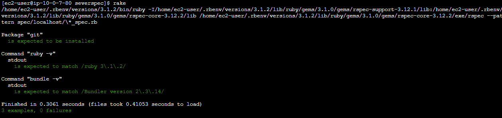
- 【補足】 上記実行後のディレクトリ・ファイル構成
  ```
  [ec2-user@ip-10-0-7-80 ~]$ pwd
  /home/ec2-user
  [ec2-user@ip-10-0-7-80 ~]$ tree
  .
  └── serverspec
      ├── Gemfile
      ├── Gemfile.lock
      ├── Rakefile
      └── spec
          ├── localhost
          │   └── sample_spec.rb
          └── spec_helper.rb

  3 directories, 5 files
  ```

#### 【 ② ServerSpec によるテストを 実行ホストからターゲットノード(ホスト)へ行う際の環境構築 】
- EC2 に `rbenv / ruby / bundler` をインストール　(  [EC2_eivironment_deploy.md](../lecture05/building_procedure/EC2_eivironment_deploy.md) を参考に実施)
- `serverspec`ディレクトリを作成　( ※ディレクトリ名は任意 )
- `serverspec`ディレクトリに移動し、 `Gemfile` を作成
- `Gemfile` に `serverspec` `rake` `ed25519` `bcrypt_pbkdf` を記載し、`bundle install` を実行
- インストール実行後、 `Gemfile.lock` が作成されることを確認
- インストール確認　`gem list | grep -e serverspec -e rake -e ed25519 -e bcrypt_pbkd`
- SeverSpecの環境設定・サンプルコード作成　`bundle exec serverspec-init`
- 【 1) UN*X 】 【 1) SSH 】 【 Vagrant instance y/n: n 】 【 Input target host name: "ターゲットホスト名/IPアドレス" 】 を選択
- `Rakefile` ・ `specディレクトリ` ・ `.rspec` など、新規ファイル・ディレクトリが作成されていることを確認　`ls`
- 作成された sample_spec.rb を編集　( 内容は同上 )
- 作成された spec_helper.rb を編集　( 下記箇所を変更 )
  ```
  #options[:user] ||= Etc.getlogin
  options[:user] ||= 'ec2-user'
  ```
- 【補足】 上記実行後のディレクトリ・ファイル構成
  ```
  [ec2-user@ip-10-0-7-80 ~]$ pwd
  /home/ec2-user
  [ec2-user@ip-10-0-7-80 ~]$ tree
  .
  └── serverspec
      ├── Gemfile
      ├── Gemfile.lock
      ├── Rakefile
      └── spec
          ├── 54.150.101.186
          │   └── sample_spec.rb
          └── spec_helper.rb

  3 directories, 5 files
  ```
#### 【 上記②を踏まえて CircleCI での自動テストの構築を実施 】
  - 上記②で作成した `serverspec` ディレクトリ配下のファイル群を、 `AWS_Work` のルートディレクトリに移動
  - `.circleci/config` に `SeverSpec` によるテストを実行する処理を追記　( ※ `Ruby` の `ORBS` を使用 )
    ```
    version: 2.1
    orbs:
      ruby: circleci/ruby@2.0.1

    jobs:
      execute-serverspec:
        executor: ruby/default
        steps:
          - checkout
          - ruby/install:  #(参考) Ruby をバージョン指定してインストール
              version: 3.1.2
          - ruby/install-deps: # Bundler を使用して gem をインストール
              bundler-version: 2.3.14  #(参考) Bundler をバージョン指定してインストール
              app-dir: serverspec #Gemfile を含むディレクトリへのパス (Gemfile がルートに存在する場合は不要)
          - run: |
              cd serverspec
              bundle exec rake

    workflows:
      AWS_Work_CircleCI:
        jobs:
          - execute-serverspec
    ```
- CircleCI上で、ServerSpecの実行結果を確認
## ■ CircleCI - 実行結果/動作確認
- CircleCI 一連の実行 ( パイプライン ) 結果
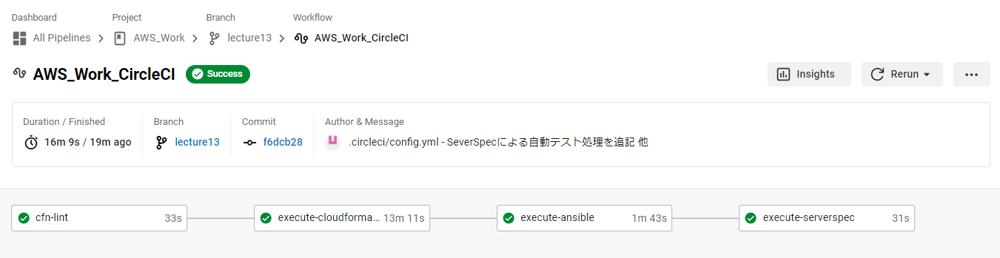
- cfn-lint の実行結果
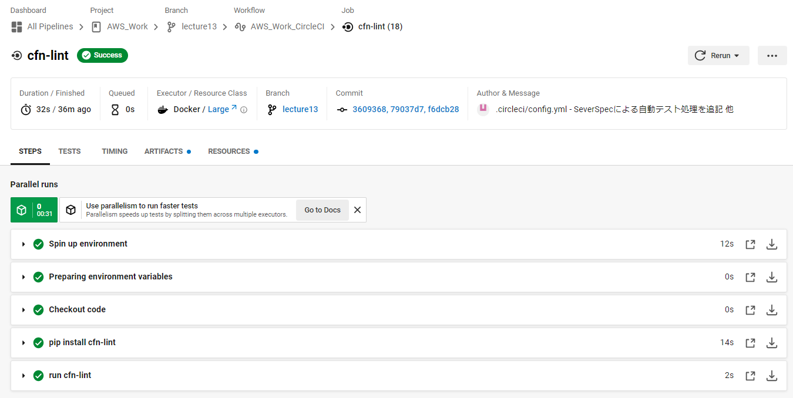
- CloudFormation の実行結果
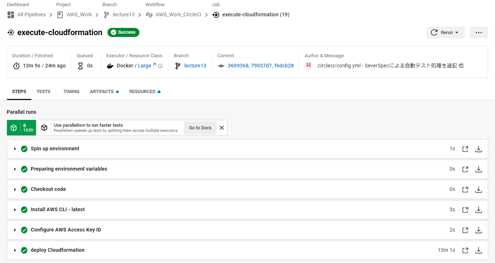<br>
( CloudFormation - スタック / リソース )<br>
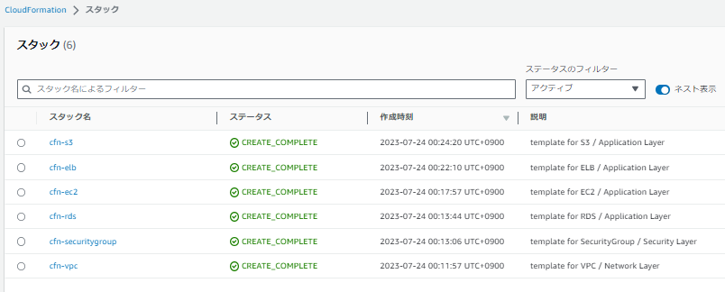
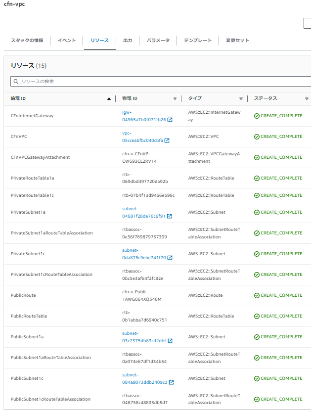
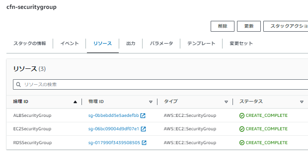
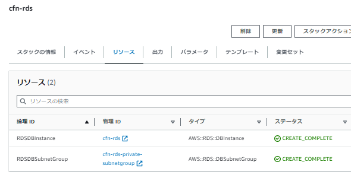
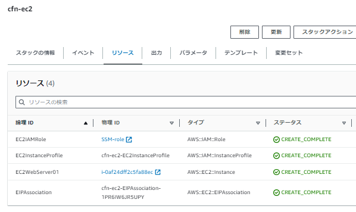
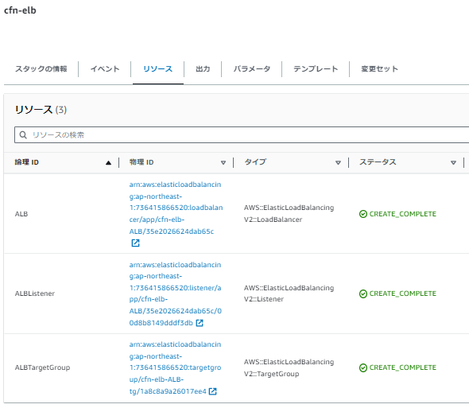
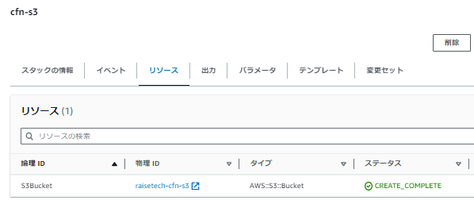
- Ansible の実行結果
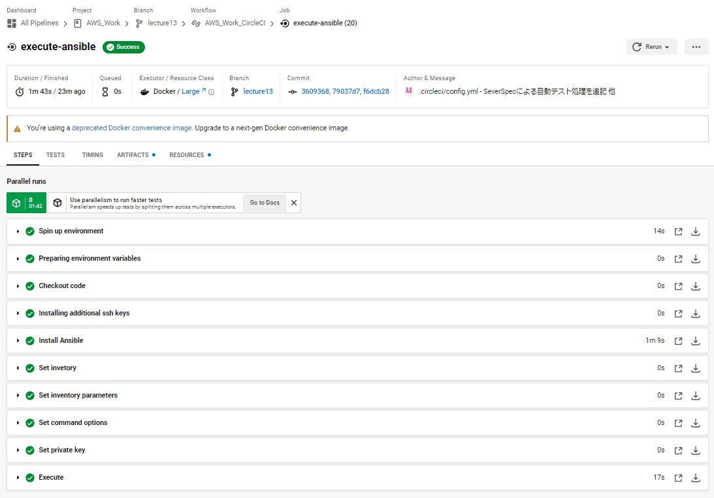
- ServerSpec の実行結果
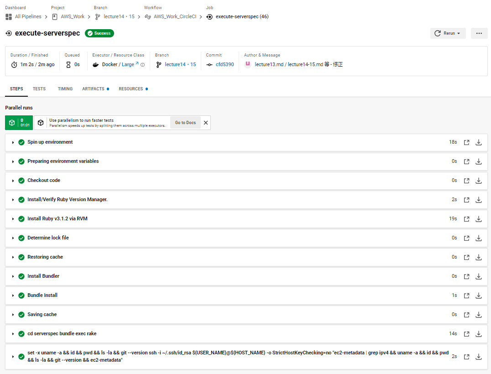
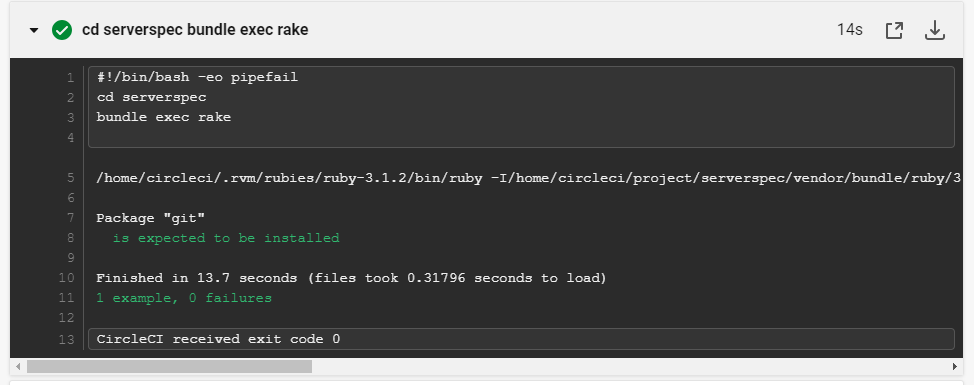

## ■ CircleCI - .circleci/config.yml の関連ファイル構成
```
.
|-- Tasks
|   |-- lecture10
|   |   |-- CloudFormation_templates
|   |      |-- 01_cfn-vpc.yml
|   |      |-- 03_cfn-rds.yml
|   |      |-- 05_cfn-elb.yml
|   |      `-- 06_cfn-s3.yml
|   `-- lecture13
|       |-- CloudFormation_templates
|          |-- 02_cfn-securitygroup-ansible.yml
|          `-- 04_cfn-ec2-ansible.yml
|-- ansible
|   |-- inventory
|   `-- playbook.yml
|-- ansible.cfg
`-- serverspec
    |-- Gemfile
    |-- Gemfile.lock
    |-- Rakefile
    `-- spec
        |-- localhost
        |   `-- sample_spec.rb
        `-- spec_helper.rb
```
## ■ 感想
- 今回の取組方針としては、インフラ構築・構成管理(プロビジョニング)・テストの自動化を最小構成で実施。
-  Lecture11 以降については、『 0-1 をまずはやってみる 』 『とりあえず実践して試してみる』 の精神・考えで取組を行いました。
- そのため、取組内容としては簡単なパーツを組み合わせて動かしてみるというイメージで実践・実施。
- 実際にこれまで手動で行ってきた作業の自動化を実施してみて、改めて各種の挙動確認や動作の理解、トライ＆エラーがいかに重要かを実感することができました。
- 今後はこれまでの過程で得たことを活かしつつ、実践した各内容の深掘りをやっていきたいと思います。

## ■ 参考リンク
<details><summary>【 Ansible 環境構築・設定 関連 】</summary>

- [Ansible ドキュメント](https://docs.ansible.com/ansible/2.9_ja/index.html)
- [Ansible のインストール](https://docs.ansible.com/ansible/2.9_ja/installation_guide/intro_installation.html)
- [Ansible 構成設定](https://docs.ansible.com/ansible/2.9_ja/reference_appendices/config.html)
- [Ansible の動作の制御: 優先順位のルール](https://docs.ansible.com/ansible/2.9_ja/reference_appendices/general_precedence.html)
- [Amazon Linux2にAnisbleをインストールする方法](https://qiita.com/tireidev/items/92dcfa6fa2a33cb11442)
- [Amazon Linux 2のExtras Library(amazon-linux-extras)を使ってみた](https://dev.classmethod.jp/articles/how-to-work-with-amazon-linux2-amazon-linux-extras/)
- [Ansible をインストールする](https://sid-fm.com/support/vm/guide/install-ansible.html)
- [Ansibleを使用したコマンドのインストール](https://engineer-blog.ajike.co.jp/ansible-1/)
- [ansible.cnfでssh_configを設定する](https://dev.classmethod.jp/articles/enable_ssh_conf_using_via_ansible-cnf/)
- [SSHコマンド実行時に生じたBad owner or permissions on /home/(user_name)/.ssh/config エラーの対処法](https://qiita.com/muramasa2/items/c58345b3ab6069d02849)
- [【完全版】SSHコマンドの基本からその実践方法まで実例付きで解説](https://itc.tokyo/linux/ssh-command/)
- [【SSH】公開鍵認証とEC2について](https://qiita.com/aiandrox/items/98ad9b7551481d890916)
- [Ansible - ディレクトリ構成について](https://qiita.com/makaaso-tech/items/0375081c1600b312e8b0)
- [【Ansible公式】ベストプラクティス](https://docs.ansible.com/ansible/2.9_ja/user_guide/playbooks_best_practices.html)
- [公式ベストプラクティスを参考に、Ansibleを1から学んでつくってみました](https://blog.engineer.adways.net/entry/2019/04/12/170000)
- [【Ansible - GALAXY】](https://galaxy.ansible.com/)

</details>

<details><summary>【 CircleCIへの組込 ( CloudFormation 関連 )  】</summary>

- [AWS公式ドキュメント - CloudFormation ( AWS::EC2::EIP )](https://docs.aws.amazon.com/AWSCloudFormation/latest/UserGuide/aws-resource-ec2-eip.html)
- [AWS公式ドキュメント - CloudFormation ( AWS::EC2::EIPAssociation )](https://docs.aws.amazon.com/AWSCloudFormation/latest/UserGuide/aws-properties-ec2-eip-association.html)
- [CloudFormationで既存EIPをEC2に割り当てる](https://blog.denet.co.jp/cloudformation-eip-ec2/)
- [【AWS】CloudFormationの作成ノウハウをまとめた社内向け資料を公開してみる](https://dev.classmethod.jp/articles/cloudformation-knowhow/)
- [CloudFormationの全てを味わいつくせ！「AWSの全てをコードで管理する方法〜その理想と現実〜」](https://dev.classmethod.jp/articles/aws-all-iac/)
- [AWS CLIのエラー「Could not connect to the endpoint URL」](https://blog.serverworks.co.jp/tech/2019/02/27/post-69261/)
- [AWS CLI のエラー「Connect timeout on/Could not connect to the endpoint URL: ～」を回避するには](https://dev.classmethod.jp/articles/tsnote-awscli-couldnotconnect-001/)
- [【CircleCI公式】Orb の概要](https://circleci.com/docs/ja/orb-intro/)
- [【CircleCI公式】circleci/aws-cli@4.0.0](https://circleci.com/developer/ja/orbs/orb/circleci/aws-cli)
- [【 set 】コマンド――シェルの設定を確認、変更する](https://atmarkit.itmedia.co.jp/ait/articles/1805/10/news023.html)

</details>

<details><summary>【 CircleCIへの組込 ( Ansible 関連 ) 】</summary>

- [【CircleCI公式】orbss/ansible-playbook@0.0.5](https://circleci.com/developer/ja/orbs/orb/orbss/ansible-playbook)
- [【CircleCI公式】CircleCI に SSH キーを登録する](https://circleci.com/docs/ja/add-ssh-key/)
- [CircleCIのJob実行環境にSSH接続する](https://dev.classmethod.jp/articles/circleci-job-contener-ssh-connect/)
- [AnsibleのSSH接続エラーの回避設定](https://qiita.com/taka379sy/items/331a294d67e02e18d68d)
- [【8つの方法】「Authenticity of Host Can’t Be Established」エラーを解決するには](https://kinsta.com/jp/knowledgebase/the-authenticity-of-host-cant-be-established/)
- [【 ssh 】コマンド――リモートマシンにログインしてコマンドを実行する](https://atmarkit.itmedia.co.jp/ait/articles/1701/26/news015.html)

</details>


<details><summary>【 CircleCIへの組込 ( ServerSpec 関連 ) 】</summary>

- [Serverspec環境構築手順](https://qiita.com/Esfahan/items/2c80f84a7ea3f71f5037)
- [Lecture05 - 【 環境構築：EC2_eivironment_deploy.md 】](../lecture05/building_procedure/EC2_eivironment_deploy.md)
- [EC2にrubyをインストールする手順 -rbenvからbundlerの解説-](https://hitolog.blog/2021/10/13/how-to-ruby-install/)
- [Lecture11 - 【 インフラの自動テスト / ServerSpec 】](../lecture11/lecture11.md)　( ※参考リンクも参照 )
- [【Rubyエラー】Could not locate Gemfile or .bundle/ directoryと出たときの対処法](https://qiita.com/Kenchiki/items/1f997f57a83a368bb538)
- [CircleCIのorbsを使って設定ファイルを整理するMEMO](https://madogiwa0124.hatenablog.com/entry/2020/09/27/233519)
- [[備忘録] CircleCI / Ruby(公式doc.の最小構成)について各設定項目の概要と参照先リンク](https://qiita.com/RiSE_blackbird/items/c0f23ca2c78499fad1b5)
- [Serverspec 最初の一歩 @ AWS EC2](https://qiita.com/hitomatagi/items/12f9f10ff8e95dbe0999)
- [Serverspec で リモート サーバをテスト @ AWS EC2](https://qiita.com/hitomatagi/items/c76fcf088daff31069ff)
- [Serverspec で複数のサーバをテスト @ AWS EC2](https://qiita.com/hitomatagi/items/956a8893aea6cb18a93f)
- [Serverspecでよく使うテストの書き方まとめ](https://qiita.com/minamijoyo/items/467ddd13c0cab15330bf)
- [【小ネタ】パブリックIPアドレスをEC2内部から確認する方法](https://blog.serverworks.co.jp/ec2/ipaddress)
- [circleci経由でEC2にSSHするとそれ以降のコマンドが実行されない](https://teratail.com/questions/213693)

</details>
