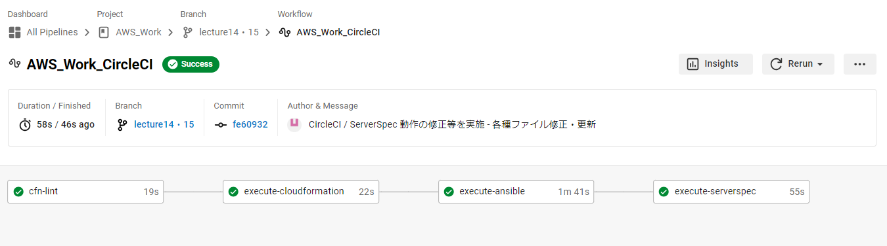

# 【 lecture14 - 15： 自動化処理フロー・AWS構成図 の作成など 】

## ■ 自動化処理フロー・AWS構成図 の作成

## ■ 前回分の修正 - ServerSpec・`.circleci/config.yml` ( 環境変数の参照 追記 ) など
- 構成図を書き起こすためフローを見返した際、テスト実行時に違和感があり SeverSpec の動作確認を実施。
- 確認の結果、SeverSpec のテストがターゲットノード(ホスト)ではなく、Localhost でテスト実行している可能性があったため関連ファイルを修正。
- それに伴い [lecture13.md - ServerSpec によるテスト実行](../lecture13/lecture13.md#-serverspec) 等、内容の加筆・修正を実施。
- 加えて別途、 [.circleci/config.yml](../../.circleci/config.yml) の環境変数 ( Environment Variables ) 参照の記述などを追記。
- 上記修正後、フロー図通り自動化処理が実行されることを確認。

## ■ README作成
- [README.md](../../README.md) に 上図 及び 実践・取組の一覧を追記
