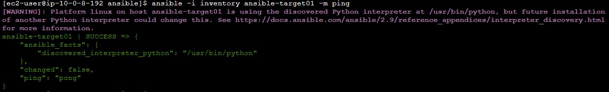
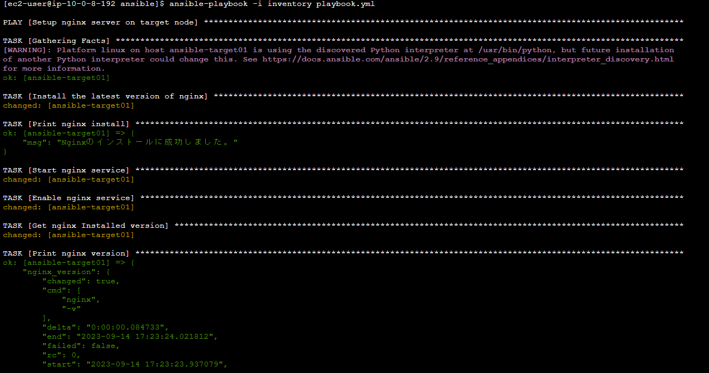
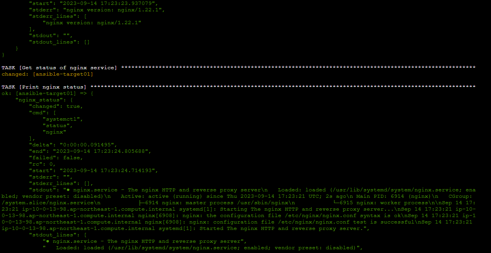
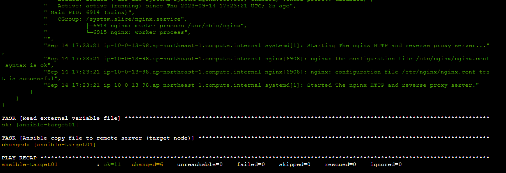
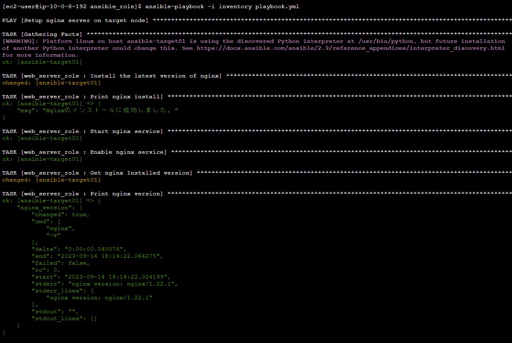
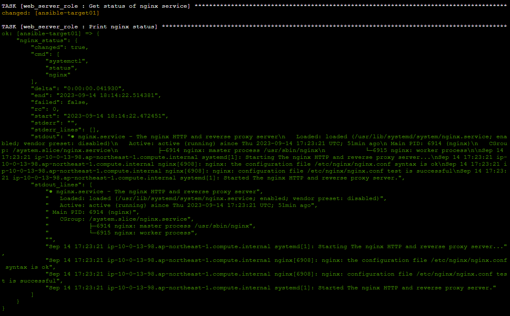
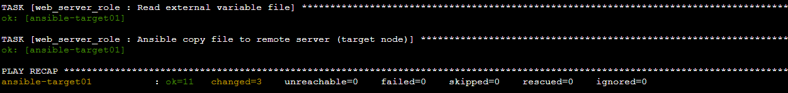
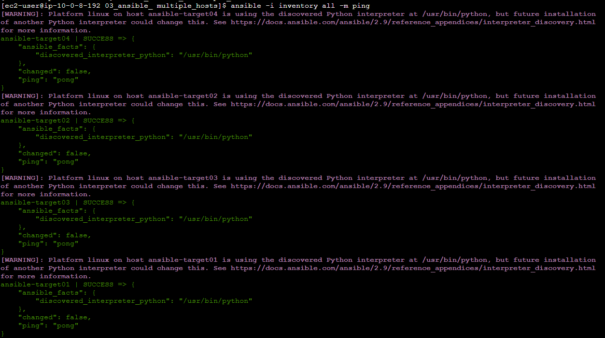
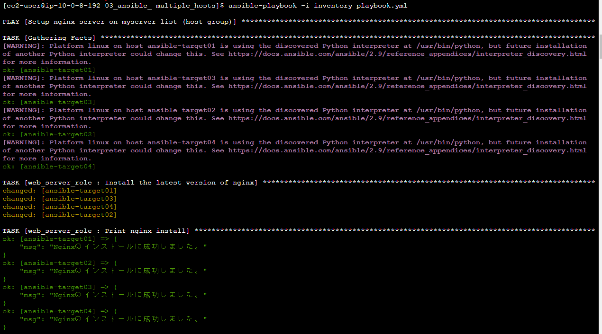
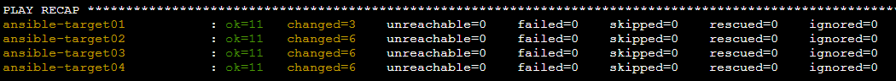

# 【 Ansible ( basic )： 動作環境構築・設定 / roles / 複数ホスト処理 】
- [Ansible の動作環境構築・設定](#-ansible-の動作環境構築設定)
- [各種設定ファイルの作成・処理実行](#-各種設定ファイルの作成処理実行)
- [作成した playbook.yml をロール分割して処理を実行](#-作成した-playbookyml-をロール分割して処理を実行)
- [複数ホストへ playbook.yml  の処理を実行](#-複数ホストへ-playbookyml--の処理を実行)
- [所感・取組観点](#-所感取組観点)
- [参考リンク](#-参考リンク)

## ■ Ansible の動作環境構築・設定
■ 構成　( コントロールノード：ターゲットノード = 1：1 )
- コントロールノード用のEC2を起動　( AMI：Amazon Linux 2 )
- SessionManager を使用してログイン、Ansibleインストールのため下記を実行
  ```
  #ユーザ切替
  $ sudo su - ec2-user

  #yumアップデート
  $ sudo yum -y update

  #Ansibleをインストール
  $ sudo amazon-linux-extras install ansible2 -y

  #インストール確認
  $ ansible --version
    ansible 2.9.23
  ```
- ターゲットノード用のEC2を起動　( AMI：Amazon Linux 2 )
- SessionManager を使用してログイン後、下記を実行
  ```
  #ユーザ切替
  $ sudo su - ec2-user

  #yumアップデート
  $ sudo yum -y update
  ```
- コントロールノードにてターゲットノードへのSSH接続設定を実施
  - SecurityGroupを適切に設定
  - ローカルの秘密鍵 (※ターゲットノードへのログインで使う秘密鍵) をコントロールノードの `~/.ssh` 配下に送付
  - コントロールノード上で上記秘密鍵の権限変更　`$ chmod 400 秘密鍵のパス`
  - 接続確認　`$ ssh -i 秘密鍵のパス ec2-user@ターゲットノードのIPアドレス`<br>
  (※この時にログインできない場合、SecurityGroupでコントロールノードからのSSH接続が許可されているか確認する)
  - 【補足】 ※別途 `~/.ssh/config` ファイルを使用する方法もある

## ■ 各種設定ファイルの作成・処理実行
- 今回のファイル構成　( 参照：[01_ansible](../practice01/01_ansible/) )
  ```
  01_ansible
  ├── inventory     # ターゲットノードの情報を記述
  ├── playbook.yml  # 処理させたい実行内容を記述
  └── vars.yml      # 変数定義ファイル
  ```
- コントロールノードにて `playbook.yml` ・ `inventory` を作成
  ```
  $ mkdir ansible
  $ cd ansible
  $ touch inventory playbook.yml vars.yml
  ```
- コントロールノードの `/etc/hosts` に名前解決ができるよう下記を追記<br>
  ```
  $ sudo vim /etc/hosts
  -------------------------------
  43.207.105.117(=EC2のパブリックipアドレス) ansible-target01(=任意のホスト名)
  ```
- `inventory` に接続するターゲットノードの情報を記述<br>
(※事前にコントロールノードからターゲットノードにSSH接続する設定が必要)
  ```
  [target_nodes]  #グループ名
  ansible-target01  #ホスト名

  [target_nodes:vars]  #上記グループのホスト群に適用される変数
  ansible_ssh_user=ec2-user
  ansible_ssh_private_key_file=~/.ssh/ansible.key.pem(=使用する秘密鍵のパス)
  ```
  - 上記の代わりに下記(1行表記)でも可　( ※/etc/hostsへの名前解決の記述もなし )
  ```
  ansible-target01 ansible_host=43.207.105.117 ansible_ssh_user=ec2-user ansible_ssh_private_key_file=~/.ssh/ansible.key.pem(=使用する秘密鍵のパス)
  ```
- `ansibleコマンド` を使用して接続(疎通) 確認　( pingモジュールを使用 )<br>
( コントロールノード → ターゲットノード　(※01_ansibleディレクトリ内でコマンドを実行) )
  ```
  #inventory記載のホスト単体を指定
  $ ansible -i inventory ansible-target01 -m ping

  (※初回接続時は接続するかの確認があるため yes を入力)

  -------------------------------------
  #inventory記載のグループ内のホスト群を指定
  $ ansible -i inventory target_nodes -m ping

  #inventory記載の全てのホストを指定
  $ ansible -i inventory all -m ping
  ```
- 接続(疎通)：成功

-  `playbook.yml` に実行させたい処理を記述　( 今回はターゲットノードに Nginx をインストール・起動等 )<br>
( ※記述内容は [01_ansible/playbook.yml](../practice01/01_ansible/playbook.yml) を参照 )
- `ansible-playbook` コマンドでplaybook記載の処理を実行<br>
( ※ansibleディレクトリ内でコマンドを実行 )
  ```
  $ ansible-playbook -i inventory playbook.yml

  -------------------------------------
  #ドライラン
  $ ansible-playbook -i inventory playbook.yml --check

  #デバッグ
  $ ansible-playbook -i inventory playbook.yml -vvv

  #ドライラン + デバッグ
  $ ansible-playbook -i inventory playbook.yml --check -vvv
  ```
- 実行結果
  <details>
  <summary>：成功</summary>

  
  
  

  </details>

<br>

- Nginxのインストール・バージョン確認　( ※ターゲットノードで下記コマンドを実行 )
  ```
  [ec2-user@ip-10-0-13-98 ~]$ nginx -v
  nginx version: nginx/1.22.1
  ```

- ブラウザでの表示確認　( ターゲットノードのipアドレス直打ち )


## ■ 作成した playbook.yml をロール分割して処理を実行
■ 構成　( コントロールノード：ターゲットノード = 1：1 )<br>
- ファイル構成　( 参照：[02_ansible_role](../practice01/02_ansible_role/) )
  ```
  02_ansible_role
  ├── inventory
  ├── playbook.yml
  ├── roles
  │   └── web_server_role
  │       └── tasks
  │           └── main.yml
  └── vars.yml
  ```
- `playbook.yml` に記載されている `tasks:` を `roles:` に書き換え、`rolesディレクトリ` 配下にファイルを分割<br>
( ※元々の `task:` パラメータに記載していた内容は `web_server_role/tasks/main.yml` に記載 )
- `ansible-playbook` コマンドでplaybook記載の処理を実行<br>
`ansible-playbook -i inventory playbook.yml`　( ※02_ansible_roleディレクトリ内でコマンドを実行 )
- 実行結果
  <details>
  <summary>：成功</summary>

  
  
  

  </details>

- ブラウザでの表示確認　( ※前回と同じであるため割愛 )

## ■ 複数ホストへ playbook.yml  の処理を実行
■ 構成　( コントロールノード：ターゲットノード = 1：4 )<br>
　：開発環境・テスト環境に分けられた各2台のEC2に処理を実行することを想定
- ファイル構成　( 参照：[03_ansible_ multiple_hosts](../practice01/03_ansible_%20multiple_hosts/) )
  ```
  03_ansible_ multiple_hosts
  ├── inventory
  ├── playbook.yml
  ├── roles
  │   └── web_server_role
  │       └── tasks
  │           └── main.yml
  └── vars.yml
  ```
- `inventory` の記述を下記に修正<br>
( ※今回は `/etc/hosts` に名前解決の記述をせず、 `inventory` に ホスト名 と ipアドレス を記載 )
  ```
  [dev_servers]
  ansible-target01 ansible_host=54.199.39.67
  ansible-target02 ansible_host=13.115.162.56

  [test_servers]
  ansible-target03 ansible_host=18.181.196.36
  ansible-target04 ansible_host=54.248.0.122

  [all:vars]
  ansible_ssh_user=ec2-user
  ansible_ssh_private_key_file=~/.ssh/ansible.key.pem
  ```
- `ansibleコマンド` を使用して接続(疎通) 確認　( pingモジュールを使用 )<br>
( コントロールノード → ターゲットノード　( ※03_ansible_ multiple_hostsディレクトリ内でコマンドを実行 ) )
  ```
  #inventory記載の全てのホストを指定
  $ ansible -i inventory all -m ping

  (※初回接続時は接続するかの確認があるため yes を入力)
  ```
- 接続(疎通)：成功

- `playbook.yml` のホスト指定の記載を下記に修正
  ```
  hosts:             # ターゲットノードを指定
    #- all           # 全てのホストを指定
    - dev_servers    # グループ(内のホスト群)を指定
    - test_servers   #　　　　　〃
  ```
- `ansible-playbook` コマンドでplaybook記載の処理を実行<br>
`ansible-playbook -i inventory playbook.yml`　( ※03_ansible_ multiple_hostsディレクトリ内でコマンドを実行 )
- 実行結果
  <details>
  <summary>：成功</summary>

  
  ( 中略 )
  

  </details>

- ブラウザでの表示確認　( ターゲットノードのipアドレス直打ち )


## ■ 所感・取組観点
- 以前 [lecture13.md](../../Tasks/lecture13/lecture13.md) で実施していた部分もあるが、再確認も兼ね、改めてAnsibleの基本をおさえるという観点で実施
- 前回はとりあえず動かしてみるという内容であったため、今回はAnsibleの使い方・作法の学習に重点を置いた
- 今後はこれを発展させ、以前実施した [サンプルアプリケーションのデプロイ(手動構築)](../../Tasks/lecture05/lecture05.md) の自動化を部分的にでも行っていきたいと思う

## ■ 参考リンク
- [【Ansible公式ドキュメント】インベントリーの構築方法](https://docs.ansible.com/ansible/2.9_ja/user_guide/intro_inventory.html)
- [Ansibleのinventory入門](https://dev.classmethod.jp/articles/inventory/)
- [Ansible:インベントリ変数について](https://noknowing.hatenablog.com/entry/2021/01/30/165136)
- [Ansible初心者の学習まとめ～Playbookの書き方解説付き～](https://www.users-digital.com/2023/09/11/4941/)
- [【Ansible】メンテナンスしやすいPlaybookの書き方](https://densan-hoshigumi.com/server/playbook-maintainability#IP)
