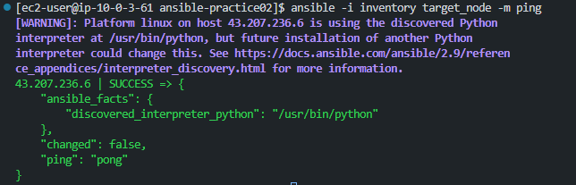
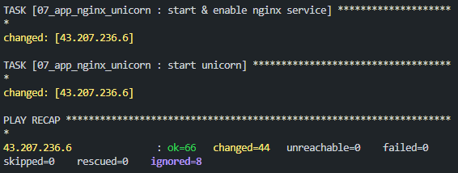
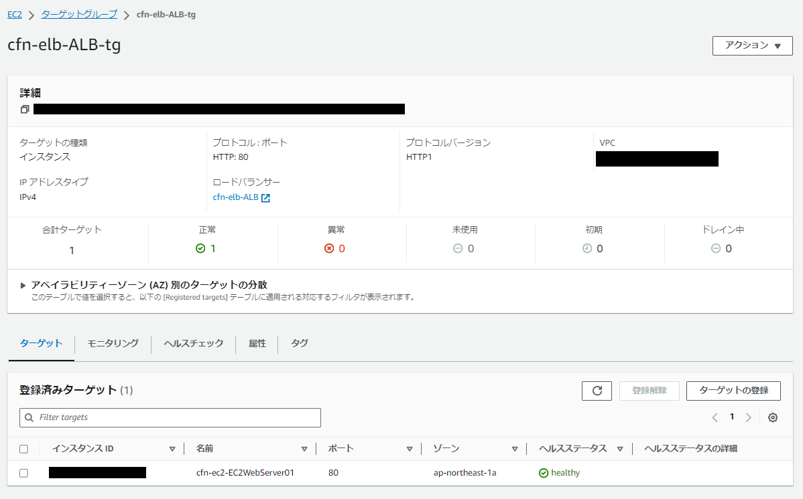
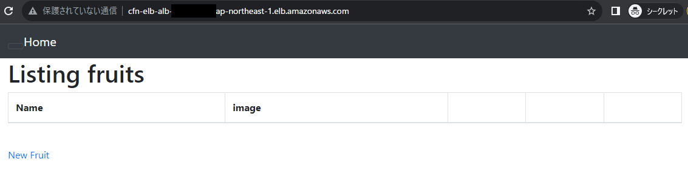
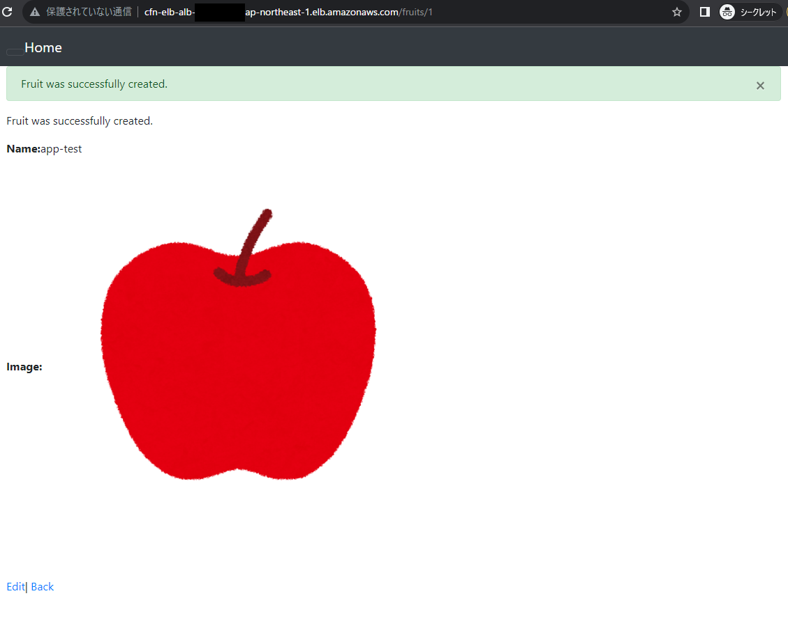
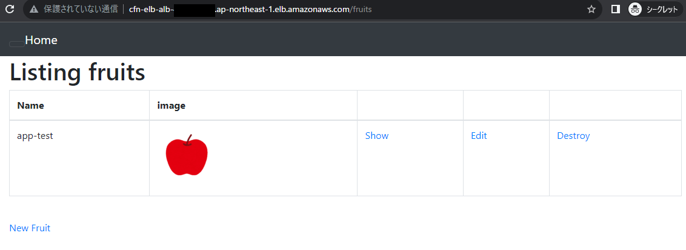
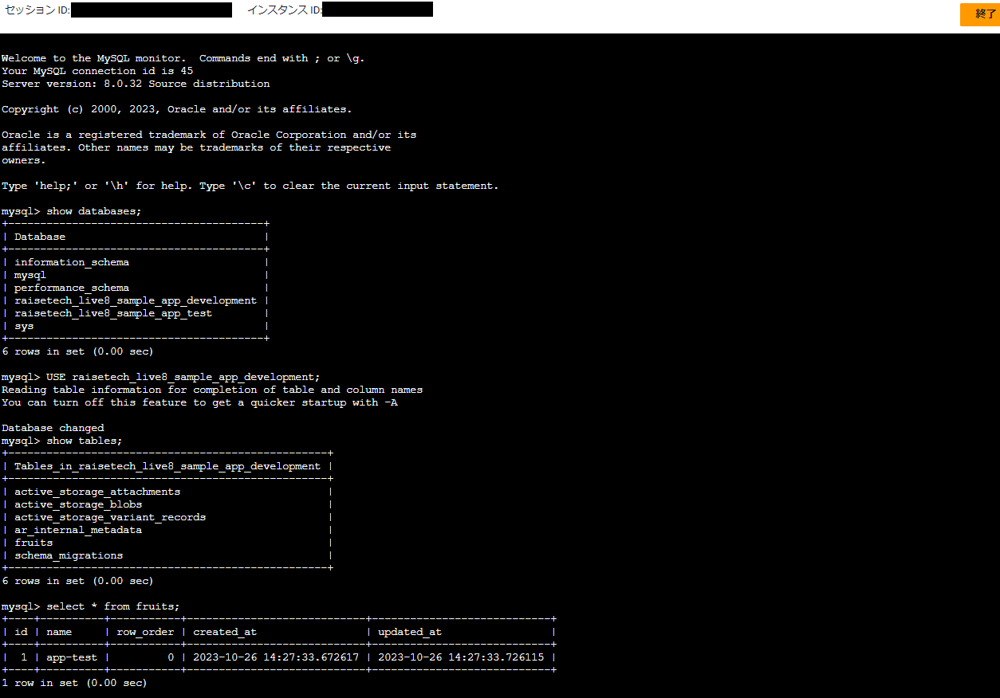
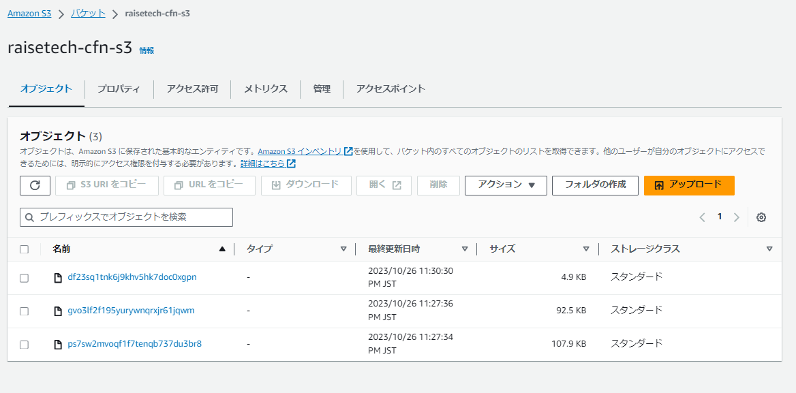
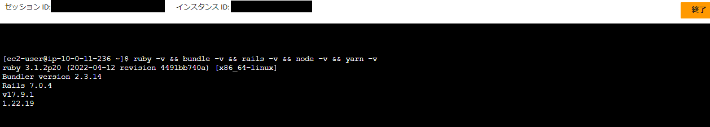

# 【 Ansible ( advanced )： サンプルアプリケーションのデプロイ・手動構築の自動化 】

## ■ 本実践内容の概要
- [lecture05.md](../../Tasks/lecture05/lecture05.md) の サンプルアプリケーションのデプロイ・手動構築 を Ansible にて自動化
- インフラリソースについては、[lecture10 の CloudFormation_templates (シングルAZ構成)](../../Tasks/lecture10/CloudFormation_templates/) を使用して構築
- 上記環境上に 新規EC2 (コントロールノード) をマネージメントコンソールで作成し、Playbook等のファイル群を作成
- コントロールノードからターゲットノードへ  OS/ミドルウェアレイヤーのインストール・設定・起動等を自動実行
- デプロイが成功しているか動作確認

## ■ 構成図・動作環境

- EC2 (ターゲットノード) - t2.medium を使用<br>
( ※既存のCFnテンプレートの記述を変更、t2.micro よりスケールアップさせ処理能力を向上 )

  | 動作環境 | バージョン |
  | -------- | ---------- |
  | Ruby     | 3.1.2      |
  | Bundler  | 2.3.14     |
  | Rails    | 7.0.4      |
  | Node     | v17.9.1    |
  | Yarn     | 1.22.19    |

## ■ インフラリソースの構築 ( IaC：CloudFormation )
- ローカルPC上で [/AWS_Work](../../../AWS_Work) に移動
- AWS CLI を使用して下記コマンドを実行してインフラリソースを構築
  ```
  $ aws cloudformation deploy --stack-name cfn-vpc --template-file  Tasks/lecture10/CloudFormation_templates/01_cfn-vpc.yml

  $ aws cloudformation deploy --stack-name cfn-securitygroup --template-file  Tasks/lecture10/CloudFormation_templates/02_cfn-securitygroup.yml

  $ aws cloudformation deploy --stack-name cfn-rds --template-file  Tasks/lecture10/CloudFormation_templates/03_cfn-rds.yml

  $ aws cloudformation deploy --stack-name cfn-ec2 --template-file  Tasks/lecture10/CloudFormation_templates/04_cfn-ec2.yml --capabilities CAPABILITY_NAMED_IAM

  $ aws cloudformation deploy --stack-name cfn-elb --template-file  Tasks/lecture10/CloudFormation_templates/05_cfn-elb.yml

  $ aws cloudformation deploy --stack-name cfn-s3 --template-file  Tasks/lecture10/CloudFormation_templates/06_cfn-s3.yml
  ```


## ■ コントロールノード作成 ( 事前準備：環境変数設定など)
- [前回](../practice01/ansible_practice01.md) のEC2のAMIを使用してコントロールノードを作成
- ターゲットノード (CFnで作成したEC2) へSSH接続する設定を必要に応じて実施 (SGなど)
- AWS CLI を使用できるように設定　`aws configure`
- jq をインストール & AWS CLI を介して情報取得した値を環境変数に設定<br>
( ※一連の処理を行うため、右記シェルスクリプトを作成：[env_set.sh](./ansible-practice02/env_set.sh) )<br>
- 適宜マネージメントコンソール上のSSMパラメータストアの情報を書き換える<br>
( 補足：RDSを新たに作成した場合、SecretManger も新規作成され、シークレットの名前の値 が変更となるため )
- 下記コマンドを実行、環境変数に値を設定<br>
( ※Ansible実行時に `vars.yml` 記載の変数の値として使用 )
  ```
  # 作成したシェルスクリプトに実行権限付与
  $ chmod +x env_set.sh

  # シェルスクリプト実行(※親シェルで実行)
  $ source env_set.sh

  # 環境変数が設定されているか確認
  $ printenv | grep -E 'AWS|DB_SOCKET_PATH'
  ```
-  `ansible-practice02` ディレクトリを作成
- 上記に各種ディレクトリ、Playbook等のファイル群を作成

## ■ ディレクトリ・ファイル構成　( コントロールノード内に作成 )
- [/ansible-practice02](../practice02/ansible-practice02/)
  ```
  /ansible-practice02
    │
    ├── ansible.cfg
    ├── env_set.sh
    ├── inventory
    ├── playbook.yml
    ├── roles
    │   ├── 00_common
    │   │   └── tasks
    │   │       └── main.yml
    │   ├── 01_ruby
    │   │   └── tasks
    │   │       └── main.yml
    │   ├── 02_bundler_rails
    │   │   └── tasks
    │   │       └── main.yml
    │   ├── 03_node_yarn
    │   │   └── tasks
    │   │       └── main.yml
    │   ├── 04_mysql
    │   │   └── tasks
    │   │       └── main.yml
    │   ├── 05_app_puma
    │   │   ├── tasks
    │   │   │   └── main.yml
    │   │   └── templates
    │   │       └── database.yml.j2
    │   ├── 06_s3
    │   │   ├── tasks
    │   │   │   └── main.yml
    │   │   └── templates
    │   │       └── storage.yml.j2
    │   └── 07_app_nginx_unicorn
    │       ├── tasks
    │       │   └── main.yml
    │       └── templates
    │           └── raisetech-live8-sample-app.conf.j2
    └── vars.yml
  ```

## ■ Ansible実行 ( コントロールノード上で実行 )
- `inventory` にターゲットノードの ipアドレスを記載
- `ansible-practice02` ディレクトリへ移動
  ```
  $ cd ansible-practice02
  ```
- ターゲットノードへ疎通確認：`andible`コマンドで実行　( pingモジュールを使用 )<br>
  ```
  $ ansible -i inventory target_node -m ping
  ```
- 疎通確認：成功

- 各種ファイル作成後、`ansible-playbook` コマンドでplaybook記載の処理を実行<br>

  ```
  $ ansible-playbook -i inventory playbook.yml
  -------------------------------------
  (参考)
  $ ansible-playbook -i inventory playbook.yml --check       #ドライラン
  $ ansible-playbook -i inventory playbook.yml -vvv          #デバッグ
  $ ansible-playbook -i inventory playbook.yml --check -vvv  #ドライラン + デバッグ
  ```
- 実行結果：成功　( ※途中結果は割愛、最終結果を表示 )


## ■ 動作確認
- ALBのヘルスチェック：正常

- ALBのDNS名をブラウザに入力し表示確認

- データ登録確認①　( ブラウザ：テキスト・画像の登録 )


- データ登録確認②<br>
( RDS - MySQL：SessionManagerでターゲットノードへログイン、MySQLコマンドを実行して確認  )

- データ登録確認③<br>
( S3連携：S3へのデータ登録も同時に行われているか確認 (※サイズ違いで同じ画像データが3つ登録されている) )

- 各種バージョン確認

  | 動作環境 | バージョン |
  | -------- | ---------- |
  | Ruby     | 3.1.2      |
  | Bundler  | 2.3.14     |
  | Rails    | 7.0.4      |
  | Node     | v17.9.1    |
  | Yarn     | 1.22.19    |

## ■所感・取組観点など
- 今回はより Ansible の発展的な内容として、<br>
これまで手動で行っていた OS/ミドルウェアレイヤー のインストール・設定・起動等の自動化を実施
- Ansibleでどのようなことができるのか、それを体験ベースで知るために今回のようなハンズオンを実施
- なかなかのボリュームだったが、一通りやり終えて非常に勉強になったと実感
- 今後は Severspec や CircleCI も活用し、より発展的な自動化を行っていきたい

## ■ 参考リンク
【 Ansible全般 】
- [【公式ドキュメント】 Ansible tips and tricks General tips](https://docs.ansible.com/ansible/latest/tips_tricks/ansible_tips_tricks.html)
- [【公式ドキュメント】 Playbook の使用 - ベストプラクティス](https://docs.ansible.com/ansible/2.9_ja/user_guide/playbooks_best_practices.html)
- [構成管理ツールのAnsibleについて丁寧に解説してみた](https://qiita.com/yuta-ushijima/items/decd8a5b6035fe76c010)
- [Ansibleで始めるインフラ構築自動化](https://www.slideshare.net/dcubeio/ansible-72056386)
- [AnsibleのRole入門](https://dev.classmethod.jp/articles/introduction_about_role/)
- [Playbookを再利用しやすくするRoleの基本と共有サービスAnsible Galaxyの使い方](https://atmarkit.itmedia.co.jp/ait/articles/1610/05/news013_2.html)

【 Ansible：モジュール関連 】
  - [ansible.builtin.yum module – Manages packages with the yum package manager](https://docs.ansible.com/ansible/latest/collections/ansible/builtin/yum_module.html)
  - [[Ansible] yum モジュールの基本的な使い方（パッケージのインストールなど）](https://tekunabe.hatenablog.jp/entry/2019/02/24/ansible_yum_intro)
  - [Ansibleのyum module:各state(present,installed,latest,absent,removed)の違い](https://qiita.com/tkit/items/7ad3e93070e97033f604)
- [community.general.gem module – Manage Ruby gems](https://docs.ansible.com/ansible/latest/collections/community/general/gem_module.html)
- [ansible.builtin.shell module – Execute shell commands on targets](https://docs.ansible.com/ansible/latest/collections/ansible/builtin/shell_module.html)
- [ansible.builtin.command module – Execute commands on targets](https://docs.ansible.com/ansible/latest/collections/ansible/builtin/command_module.html)
- [ansible.builtin.blockinfile module – Insert/update/remove a text block surrounded by marker lines](https://docs.ansible.com/ansible/latest/collections/ansible/builtin/blockinfile_module.html)
- [ansible.builtin.file module – Manage files and file properties](https://docs.ansible.com/ansible/latest/collections/ansible/builtin/file_module.html)
- [ansible.builtin.stat module – Retrieve file or file system status](https://docs.ansible.com/ansible/latest/collections/ansible/builtin/stat_module.html)
