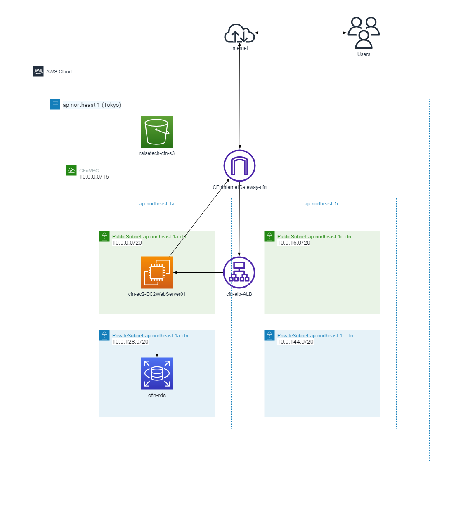
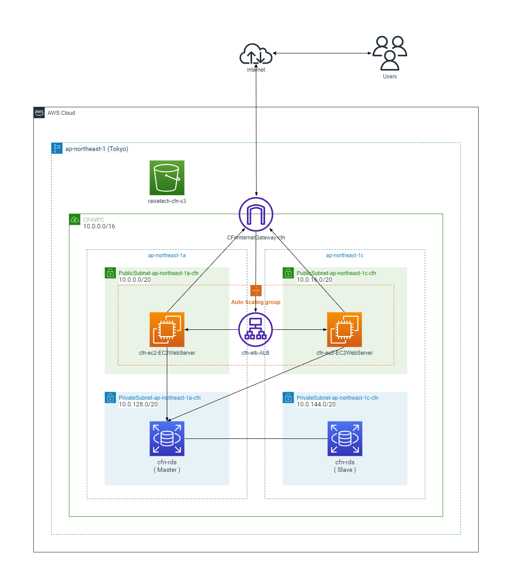
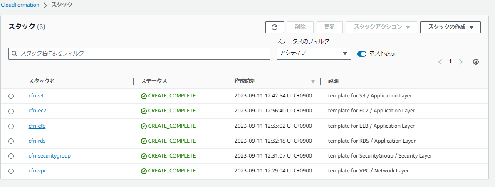
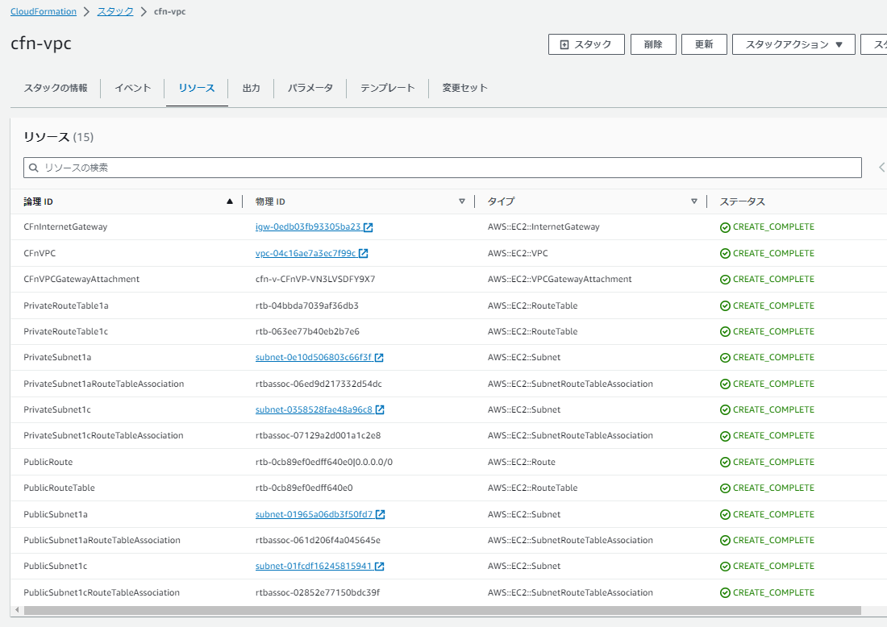
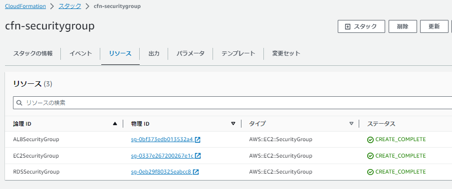
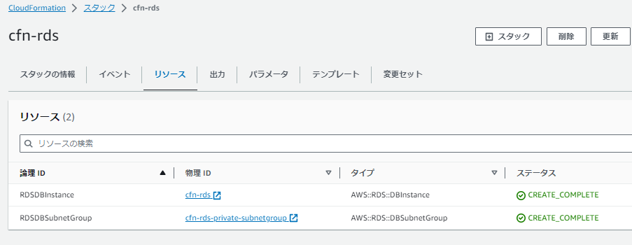
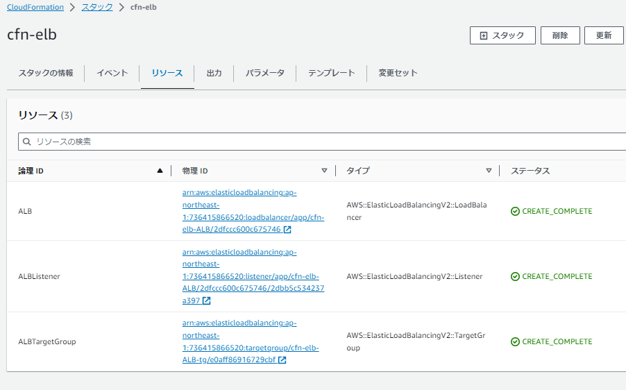
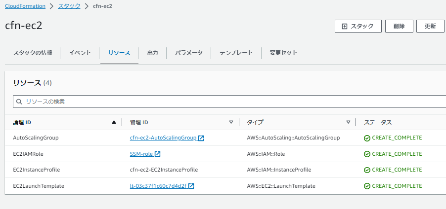
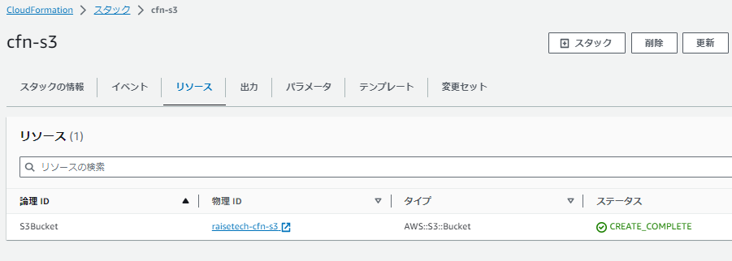

# CloudFormation：冗長化構成 ( redundant configuration ) に変更

## ■ 構成図
 - 変更前　( シングルAZ構成 )
 

- 変更後　( マルチAZ構成 )
  

## ■ インフラリソースの追加・設定変更
- [lecture10.md](../../Tasks/lecture10/lecture10.md) で作成した既存の [CloudFormation_templates](../../Tasks/lecture10/CloudFormation_templates/) に、上図の マルチAZ・冗長化構成 となるよう下記内容を追記・修正
  - EC2 - シングルAZ から マルチAZ配置<br>
  ( ※起動テンプレートを作成、AutoScalingに適用してEC2を起動 )<br>
  ( ※既存のEC2の記述は削除 )
  - RDS - シングルAZ から マルチAZ配置　( ※MautiAZの有効化 )
- 作成後の CFnテンプレート：[cfn_templates_redundant_configuration](./cfn_templates_redundant_configuration/)

## ■ AWS CLI で下記コマンドを実行してリソース構築
```
$pwd
/AWS_Work

$ aws cloudformation deploy --stack-name cfn-vpc --template-file  cloudformation/practice01/cfn_templates_redundant_configuration/01_cfn-vpc.yml

$ aws cloudformation deploy --stack-name cfn-securitygroup --template-file  cloudformation/practice01/cfn_templates_redundant_configuration/02_cfn-securitygroup.yml

$ aws cloudformation deploy --stack-name cfn-rds --template-file  cloudformation/practice01/cfn_templates_redundant_configuration/03_cfn-rds_multiaz.yml

$ aws cloudformation deploy --stack-name cfn-elb --template-file  cloudformation/practice01/cfn_templates_redundant_configuration/04_cfn-elb_autoscaling.yml

$ aws cloudformation deploy --stack-name cfn-ec2 --template-file  cloudformation/practice01/cfn_templates_redundant_configuration/05_cfn-ec2_autoscaling.yml --capabilities CAPABILITY_NAMED_IAM

$ aws cloudformation deploy --stack-name cfn-s3 --template-file  cloudformation/practice01/cfn_templates_redundant_configuration/06_cfn-s3.yml
```

## ■ 作成リソース
- [cfn_templates_redundant_configuration](./cfn_templates_redundant_configuration/) - ファイル構成
  ```
  cfn_templates_redundant_configuration
  |-- 01_cfn-vpc.yml
  |-- 02_cfn-securitygroup.yml
  |-- 03_cfn-rds_multiaz.yml
  |-- 04_cfn-elb_autoscaling.yml
  |-- 05_cfn-ec2_autoscaling.yml
  `-- 06_cfn-s3.yml
  ```
- 構築リソース
  - 各リソースのスタック
  
  - VPC - Network Layer　( 使用テンプレート：[01_cfn-vpc.yml](./cfn_templates_redundant_configuration/01_cfn-vpc.yml) )
  
  - SecurityGroup - Security Layer　( 使用テンプレート：[02_cfn-securitygroup.yml](./cfn_templates_redundant_configuration/02_cfn-securitygroup.yml) )
  
  - RDS - Application Layer　( 使用テンプレート：[03_cfn-rds_multiaz.yml](./cfn_templates_redundant_configuration/03_cfn-rds_multiaz.yml) )
  
  - ELB (ALB) - Application Layer　( 使用テンプレート：[04_cfn-elb_autoscaling.yml](./cfn_templates_redundant_configuration/04_cfn-elb_autoscaling.yml) )
  
  - EC2 - Application Layer　( 使用テンプレート：[05_cfn-ec2_autoscaling.yml](./cfn_templates_redundant_configuration/05_cfn-ec2_autoscaling.yml) )
  
  - S3 - Application Layer　( 使用テンプレート：[06_cfn-s3.yml](./cfn_templates_redundant_configuration/06_cfn-s3.yml) )
  

## ■ 検証・気づき・工夫点・備忘録
■ スタック構築順序に関して
-  AWS CLI でのスタック構築順を [lecture10.md](../../Tasks/lecture10/lecture10.md) より変更　( ※EC2より先にALBを構築するように変更 )
- これは、`05_cfn-ec2_autoscaling.yml` 内に記載している `AutoScalingGroup - TargetGroupARNs` で、 <br>
`04_cfn-elb_autoscaling.yml` で記載しているターゲットグループのARNの情報が必要であるため　( ※クロススタック参照にて情報を参照するようにしている )
- 上記は、一枚の CFnテンプレートに記述する方式では `DependsOn属性` を使用して依存関係を考慮したリソース構築順序の指定をすることができる<br>

■ AutoScaling を使用した EC2 の起動に関して
- 起動テンプレート・AutoScalingを使用してEC2を起動する際、ALBのヘルスチェックが Unhealty だと EC2 が起動と終了を繰り返してしまう
- そのため、起動テンプレートのユーザデータに `httpd` をインストールし、空の `index.html` を `/var/www/html` 配下に作成する記述を行いヘルスチェックが通るよう対応<br>

■ EC2 / RDS の接続・データ同期等の確認に関して
- EC2へは SessionManager にて接続
- その後、EC2 から RDS への接続確認は MySQLコマンド にてログインを実施　(※RDSのエンドポイントを指定してログイン)
- その際にDB・テーブル・レコードを作成し、他AZ配置のEC2より上記で作成されたRDSのレコードが参照できるかを確認
- 上記状態で RDS をフェイルオーバーして再起動を実施、スタンバイ側のAZに切り替わっていることを確認　( ※RDSのイベントログも確認 )
- その後、各AZに配置されている EC2 より再度 RDS へ MySQLコマンド にてログイン
- 作成したレコードを参照できることを確認し、データが同期されていることを確認


## ■ 参考リンク
- AWS公式ドキュメント関連
  - [AWS::ElasticLoadBalancingV2::TargetGroup](https://docs.aws.amazon.com/ja_jp/AWSCloudFormation/latest/UserGuide/aws-resource-elasticloadbalancingv2-targetgroup.html#aws-resource-elasticloadbalancingv2-targetgroup-return-values)
  - [AWS::ElasticLoadBalancingV2::TargetGroup TargetDescription](https://docs.aws.amazon.com/ja_jp/AWSCloudFormation/latest/UserGuide/aws-properties-elasticloadbalancingv2-targetgroup-targetdescription.html#cfn-elasticloadbalancingv2-targetgroup-targetdescription-id)
  - [AWS::AutoScaling::AutoScalingGroup](https://docs.aws.amazon.com/ja_jp/AWSCloudFormation/latest/UserGuide/aws-properties-as-group.html#cfn-as-group-loadbalancernames)
  - [AWS::AutoScaling::AutoScalingGroup LaunchTemplateSpecification](https://docs.aws.amazon.com/ja_jp/AWSCloudFormation/latest/UserGuide/aws-properties-autoscaling-autoscalinggroup-launchtemplatespecification.html#cfn-autoscaling-autoscalinggroup-launchtemplatespecification-version)
  - [[Outputs] ](https://docs.aws.amazon.com/ja_jp/AWSCloudFormation/latest/UserGuide/outputs-section-structure.html)
  - [DependsOn 属性](https://docs.aws.amazon.com/ja_jp/AWSCloudFormation/latest/UserGuide/aws-attribute-dependson.html)
  - [AWS::EC2::LaunchTemplate](https://docs.aws.amazon.com/ja_jp/AWSCloudFormation/latest/UserGuide/aws-resource-ec2-launchtemplate.html#aws-resource-ec2-launchtemplate--examples)
  - [AWS::EC2::LaunchTemplate LaunchTemplateTagSpecification](https://docs.aws.amazon.com/ja_jp/AWSCloudFormation/latest/UserGuide/aws-properties-ec2-launchtemplate-launchtemplatetagspecification.html)
  - [AWS::EC2::LaunchTemplate LaunchTemplateData](https://docs.aws.amazon.com/ja_jp/AWSCloudFormation/latest/UserGuide/aws-properties-ec2-launchtemplate-launchtemplatedata.html#cfn-ec2-launchtemplate-launchtemplatedata-userdata)
  - [AWS::EC2::LaunchTemplate NetworkInterface](https://docs.aws.amazon.com/ja_jp/AWSCloudFormation/latest/UserGuide/aws-properties-ec2-launchtemplate-networkinterface.html#cfn-ec2-launchtemplate-networkinterface-deviceindex)
  - [AWS::EC2::LaunchTemplate IamInstanceProfile](https://docs.aws.amazon.com/ja_jp/AWSCloudFormation/latest/UserGuide/aws-properties-ec2-launchtemplate-iaminstanceprofile.html)
  - [AWS::IAM::InstanceProfile](https://docs.aws.amazon.com/ja_jp/AWSCloudFormation/latest/UserGuide/aws-resource-iam-instanceprofile.html#aws-resource-iam-instanceprofile--seealso)
  - [組み込み関数リファレンス](https://docs.aws.amazon.com/ja_jp/AWSCloudFormation/latest/UserGuide/intrinsic-function-reference.html)
  - [Fn::GetAtt](https://docs.aws.amazon.com/ja_jp/AWSCloudFormation/latest/UserGuide/intrinsic-function-reference-getatt.html)
  - [Fn::Sub](https://docs.aws.amazon.com/ja_jp/AWSCloudFormation/latest/UserGuide/intrinsic-function-reference-sub.html)
  - [Ref](https://docs.aws.amazon.com/ja_jp/AWSCloudFormation/latest/UserGuide/intrinsic-function-reference-ref.html)
  - [AWS::RDS::DBInstance](https://docs.aws.amazon.com/AWSCloudFormation/latest/UserGuide/aws-resource-rds-dbinstance.html#cfn-rds-dbinstance-multiaz)
  - [Configuring and managing a Multi-AZ deployment
](https://docs.aws.amazon.com/AmazonRDS/latest/UserGuide/Concepts.MultiAZ.html)
  - [Multi-AZ DB instance deployments](https://docs.aws.amazon.com/AmazonRDS/latest/UserGuide/Concepts.MultiAZSingleStandby.html#Concepts.MultiAZ.Migrating.Convert)
  - [Rebooting a DB instance](https://docs.aws.amazon.com/AmazonRDS/latest/UserGuide/USER_RebootInstance.html)
- その他
  - [冗長構成 【redundant configuration】](https://e-words.jp/w/%E5%86%97%E9%95%B7%E6%A7%8B%E6%88%90.html)
  - [よく使うMySQLコマンド&構文集](https://qiita.com/CyberMergina/items/f889519e6be19c46f5f4)
